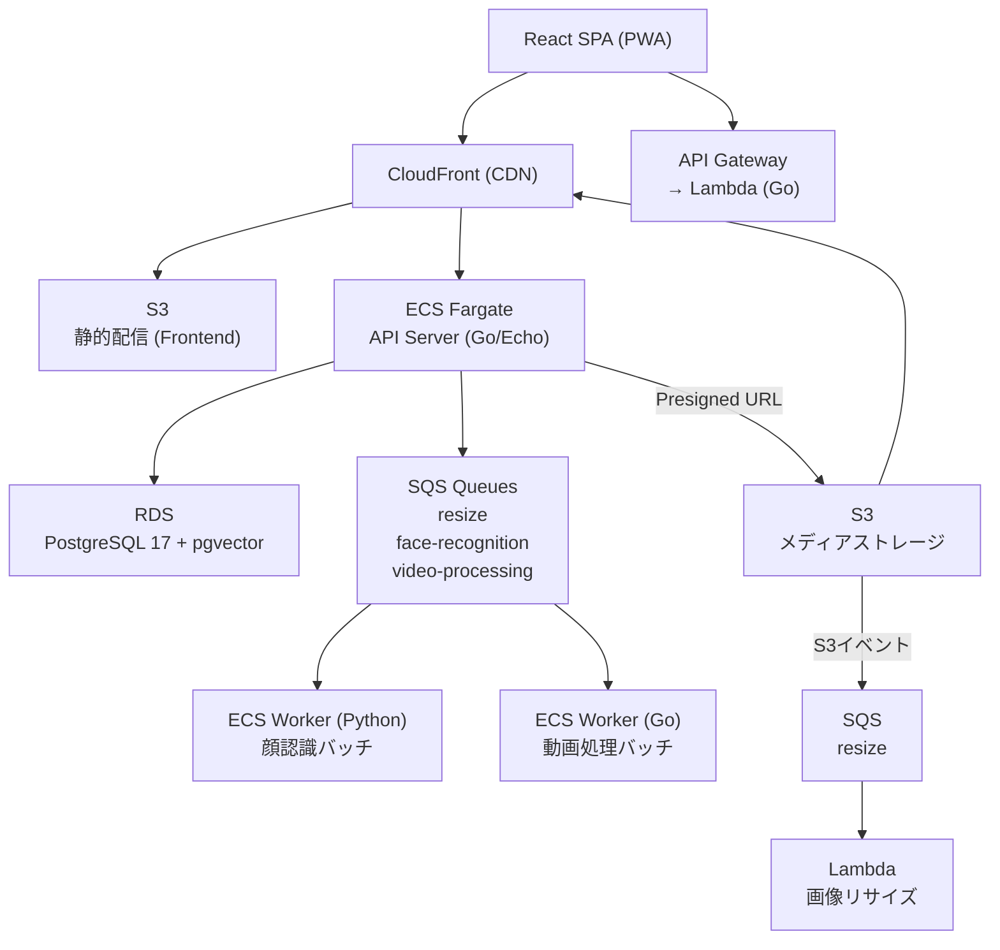
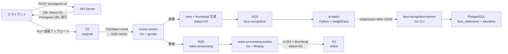

# YUNO — 家族写真共有プラットフォーム

家族の写真・動画を安全に共有し、AI による顔認識で人物ごとに検索できるプライベートフォトプラットフォーム。

---

## 技術スタック

| レイヤー      | 技術                                                                                                   |
| ------------- | ------------------------------------------------------------------------------------------------------ |
| **Backend**   | Go 1.24, Echo v4, sqlc, golang-migrate, JWT, govips, FFmpeg                                            |
| **Frontend**  | React 18, TypeScript, Vite, TanStack Query, React Hook Form, Zod, Tailwind CSS, PWA                    |
| **AI**        | Python 3, InsightFace (ONNX), OpenCV                                                                   |
| **Infra**     | Terraform, AWS (ECS Fargate / Lambda / S3 / CloudFront / SQS / RDS / Route53 / ACM / CloudWatch / SSM) |
| **Local Dev** | Docker Compose, MinIO, ElasticMQ, PostgreSQL 17 + pgvector                                             |

---

## システムアーキテクチャ



### ローカル開発環境との対応

| 本番 (AWS)     | ローカル              |
| -------------- | --------------------- |
| S3             | MinIO (S3互換)        |
| SQS            | ElasticMQ (SQS互換)   |
| RDS PostgreSQL | Docker PostgreSQL     |
| ECS Worker     | Docker Compose Worker |

---

## バックエンド設計

### Clean Architecture

```
Handler (HTTP) → Service (ビジネスロジック) → Store (データアクセス) → DB (sqlc生成コード)
```

責務を明確に分離することで、テスト容易性と変更への耐性を確保している。

```
server
    |
    |-- cmd (エントリポイント)
    |    |-- api
    |    |-- resize
    |    |-- video-processing-worker
    |    |-- face-recognition-worker
    |    |-- lambda
    |    |-- db
    |-- internal
    |    |
    |    |-- api (API ハンドラー)
    |    |    |
    |    |    |-- handlers (HTTP ハンドラー)
    |    |    |-- middlewares (HTTP ミドルウェア)
    |    |    |-- routers (API ルーター)
    |    |    |-- app.go (Echo アプリケーション初期化)
    |    |-- worker (ワーカー)
    |    |    |-- handlers (ワーカー HTTP ハンドラー)
    |    |    |-- services (ワーカー サービス)
    |    |-- store （データアクセス層）
    |    |-- db (sqlc生成コード)
    |    |-- services (共通ビジネスロジック)
    |    |-- providers (依存注入)
    |    |-- validator (バリデーション)
    |    |-- i18n (国際化)
    |    |-- logger (ロギング)
    |    |-- oauth (OAuth プロバイダー)
    |    |-- consts (定数)
    |    |-- enums (列挙型)
    |    |-- apperr (カスタムエラー)
    ．．．


```

APIサーバー、画像処理、動画処理、顔認識など複数の実行環境を単一コードベースで管理していて，共通ロジックを集約しつつエントリポイントごとに責務を分離することで、保守性と拡張性を向上している。

### 型安全なクエリ（sqlc）

SQL を直接記述し、sqlc で Go コードを自動生成する。  
ORM のリフレクションを使わず、コンパイル時に型の整合性が保証されるためランタイムエラーを排除できる。

### マルチテナント設計

すべてのテーブルに `family_id` を持たせ、クエリレベルで家族間のデータを完全に分離している。  
アルバムには `album_groups_permissions` テーブルで Read / Write 権限を付与できる。

### 認証

- JWT（アクセストークン + リフレッシュトークン）
- LINE OAuth / Kakao OAuth 対応
- 招待トークン（有効期限付き）によるメンバー追加

---

## アップロードパイプライン

クライアントは API サーバーを経由せず S3 に直接アップロードし、SQS で後続処理をトリガーする。



### 状態遷移

| コード | 状態       | 説明                               |
| ------ | ---------- | ---------------------------------- |
| `01`   | pending    | Presigned URL 発行済み、S3 待ち    |
| `02`   | processing | resize-worker 処理中               |
| `03`   | completed  | 処理完了（閲覧可能）               |
| `04`   | failed     | 処理失敗（状態リセットで再処理可） |

### 設計上のポイント

**API サーバーを経由しない直接アップロード**: クライアントは Presigned URL を取得し、メディアファイルを S3 へ直接 PUT する。API サーバーにバイナリデータが流れないため、帯域コストとレイテンシを削減できる。

**イベント駆動の後続処理**: S3 PutObject イベントが SQS に流れ、resize-worker が自動的に起動する。アップロード API はファイルの受け渡し後すぐにレスポンスを返せるため、クライアントの待機時間をゼロに抑えられる。

**バッチ Presigned URL 発行**: 複数ファイルを 1 リクエストでまとめて処理することで、n 枚アップロード時の API ラウンドトリップを 1 回に削減している。

**ポーリングによる非同期ステータス追跡**: アップロード後はクライアントが 5 秒間隔で `upload_batch_status` をポーリングし、resize・顔認識の完了を検知する。WebSocket 接続を維持せずに済むため、Lambda 環境でも動作する。

**アップロードリカバリー**: `localStorage` に進行中の `batchId` を保持し、ページリロードや誤って離脱した場合でも自動的に処理状況を再取得できる。

### S3 バケット構造

```
yuno-media-bucket/
├── original/    ← クライアント Presigned PUT 対象（公開読み取り不可）
├── view/        ← 2048px WebP（CloudFront OAC のみ読み取り可）
├── thumbnail/   ← 512px WebP（同上）
├── video/       ← H.264 MP4（同上）
└── identities/  ← 顔クロップ 512×512 WebP（同上）
```

---

## インフラ構成と設計判断

### ECS Fargate — 動画処理・顔認識 Worker

動画リサイズ・顔認識はレイテンシが大きく、アップロード API のレスポンスに含めることができない。
SQS を挟んで非同期化することで以下を実現している：

- アップロード API の応答速度を維持
- Worker の失敗時に自動リトライ（Visibility Timeout）
- 一定回数失敗したジョブを DLQ に隔離しデータ損失を防止

### CloudWatch Events — Fargate Worker のオンデマンド起動

動画処理および顔認識は利用頻度が低く、個人利用ではアップロードが発生しない日も多い。

Worker を常時起動する場合、アイドル状態でもコストが発生し続ける。そのため SQS のメッセージ数を CloudWatch で監視し、キューにジョブが投入された場合のみ ECS Fargate タスクを起動する構成を採用した。

ECS Auto Scaling のスケジュールベースやメトリクスベースも検討したが、最小タスク数を 0 に設定しつつジョブ検知時のみ起動するには、CloudWatch Events から直接 ECS RunTask を呼び出す構成が最もシンプルだった。

- 通常時はタスク数 0 を維持し、アイドルコストを削減
- ジョブ投入時のみ自動的にスケールアウト
- 処理完了後は再び 0 までスケールイン

### Lambda — API サーバー

個人利用規模ではリクエスト数が少なく、常時稼働サーバーを維持するメリットが小さい。Lambda はリクエスト数に応じた従量課金のためアイドルコストが発生せず、現状の利用規模では無料枠内に収まっている。

将来的にアクセス数が増加した場合は ECS Fargate + ALB 構成へ移行できるよう、アプリケーションは Lambda 固有の実装に依存しない構造としている。

### Lambda — 画像リサイズ

S3 へのアップロード完了をトリガーに起動するイベント駆動の処理。  
アイドル時のコストが発生せず、バースト的なアップロードにも自動でスケールするため Lambda が最適だった。

### SQS — 非同期ジョブキュー

顔認識・動画処理はレイテンシが大きく、アップロード API のレスポンスに含めることができない。  
SQS を挟んで非同期化することで以下を実現している：

- アップロード API の応答速度を維持
- Worker の失敗時に自動リトライ（Visibility Timeout）
- 一定回数失敗したジョブを DLQ に隔離しデータ損失を防止

### S3 + CloudFront — メディアストレージ + CDN

Presigned URL を発行することで、メディアファイルの送受信が API サーバーを経由しない。  
API サーバーの負荷とコストを削減しつつ、CloudFront によりレイテンシを改善している。

### Terraform — IaC

```
infra/
├── environments/
│   └── production/    # 本番環境エントリポイント
└── modules/
    ├── ecs/           # ECS タスク定義・サービス
    ├── lambda/        # Lambda 関数
    ├── s3/            # メディア・フロントエンド
    ├── cloudfront/    # CDN
    ├── sqs/           # キュー
    ├── iam/           # 最小権限ロール
    ├── api_gateway/   # HTTP API
    ├── cloudwatch/    # ログ・アラート
    └── ssm/           # パラメータストア
```

- モジュール分割により、サービス単体の変更が他に影響しない構造
- S3 バックエンドで tfstate をリモート管理（チーム開発・CI/CD 対応）
- SSM Parameter Store で機密情報を管理し、リポジトリに環境変数ファイルを含めない

---

## AI 顔認識パイプライン

```
写真アップロード
    → S3 保存
    → Lambda (サムネイル生成)
    → API Server が SQS に顔認識ジョブを発行
    → Python Worker が SQS からメッセージを受信
    → InsightFace (ONNX) で顔検出 → 512次元埋め込みを生成
    → PostgreSQL (pgvector) に保存
    → フロントエンドでコサイン類似度検索が可能に
```

- **InsightFace**: ONNX 形式のモデルで高精度な顔検出と特徴量抽出
- **pgvector IVFFlat**: 大量の顔埋め込みに対する近傍検索を効率化
- **Identity（人物管理）**: 人物ごとに複数の顔埋め込みを保持し、その平均ベクトルを代表ベクトルとして管理する。新規顔とのコサイン類似度が閾値（0.6）以上の場合に同一人物候補として提示する。

---

## 障害耐性

本サービスではアップロード後の処理をすべて非同期化し、一時的な障害によるデータ損失を防止している。

**SQS + DLQ によるジョブ保護**

顔認識および動画処理は SQS を介して実行する。Worker 障害時は Visibility Timeout により自動リトライし、一定回数失敗したジョブは DLQ に隔離する。DLQ に隔離されたジョブは手動で再実行が可能。

**再処理可能な設計**

メディアのソースデータは常に S3 の `original/` に保存される。派生データ（view / thumbnail / face embedding）はいつでも再生成できるため、処理失敗時も再実行のみで復旧可能。status=`04`（failed）として記録されたメディアは、ステータスリセット後に再処理できる。

**ステートレス API**

API サーバーはステートレス構成のため、インスタンス障害時も他のインスタンスへ即時フェイルオーバーできる。

---

## コスト最適化

個人開発でも継続運用できるよう、利用頻度を考慮したコスト設計を行っている。

| コンポーネント  | 最適化内容                                   |
| --------------- | -------------------------------------------- |
| API サーバー    | Lambda によりアイドルコスト 0                |
| 顔認識 Worker   | 通常時タスク数 0、SQS 監視でオンデマンド起動 |
| 動画処理 Worker | 通常時タスク数 0、同上                       |
| メディア配信    | CloudFront キャッシュでオリジン転送量を削減  |
| ベクトル検索    | pgvector により専用ベクトル DB 不要          |

Worker の常時起動を廃止したことで、アップロードが発生しない日はコンピューティングコストがほぼゼロになる。

---

## セキュリティ

**マルチテナント分離**

すべての主要テーブルに `family_id` を持たせ、クエリレベルでデータを分離している。他の家族のメディアへアクセスできないよう、全取得系 API で `family_id` を条件に含めている。

**メディアアクセス制御**

`original/` バケットは公開アクセスを完全に禁止している。閲覧用メディア（view / thumbnail / video）は CloudFront OAC を経由した場合のみアクセス可能とし、S3 URL の直接公開を防いでいる。

**CloudFront Signed Cookie**

ログイン時に テナント（family） スコープの Signed Cookie（有効期限 12 時間）を発行する。CloudFront はリクエストごとに署名を検証するため、URL を直接知っていても他の家族のメディアにはアクセスできない。

**IAM 最小権限**

Lambda・ECS タスクには必要最小限の IAM 権限のみを付与している。例えば顔認識 Worker は対象 S3 パスと SQS のみへのアクセス権を持ち、不要な AWS リソースへのアクセスを持たない。

---

## フロントエンド設計

### Feature-based アーキテクチャ

```
src/
├── page/        # ルートに対応する薄いラッパー
├── feature/     # ドメイン単位 (auth / home / search / upload / settings / ...)
│   └── <domain>/
│       ├── components/
│       ├── hooks/
│       └── types/
├── components/  # 共通 UI コンポーネント (Radix / shadcn)
├── service/     # API 呼び出し関数
└── lib/         # Axios インスタンス・React Query クライアント
```

ドメインをまたぐ依存を排除し、機能追加時の影響範囲を局所化している。

### サーバー状態管理（TanStack Query）

API レスポンスのキャッシュ・再フェッチ・楽観的更新を TanStack Query で一元管理している。  
カスタムフックで各ドメインのデータ取得ロジックをカプセル化している。

### その他

- **PWA 対応**: Workbox によるオフラインキャッシュ
- **多言語対応**: i18next で日本語 / 韓国語を切り替え
- **フォームバリデーション**: React Hook Form + Zod でスキーマ駆動のバリデーション

---

## ローカル開発環境

```bash
# 全サービス起動（PostgreSQL / MinIO / ElasticMQ / Worker 含む）
docker compose up -d

# DB マイグレーション
make migrate

# シードデータ投入
make seed

# sqlc コード再生成（スキーマ変更後）
make sqlc
```

本番と同一のインターフェースで動作するため、ローカルで確認した動作が本番でも再現される。

---

## ディレクトリ構成

```
yuno/
├── server/          # Go + Echo (Backend API)
│   ├── cmd/
│   │   ├── api/                     # メイン API サーバー
│   │   ├── lambda/api/              # AWS Lambda エンドポイント
│   │   ├── video-processing-worker/ # 動画処理ワーカー
│   │   └── resize/                  # 画像リサイズ (Webhook)
│   ├── internal/
│   │   ├── api/handlers/            # HTTP ハンドラー
│   │   ├── services/                # ビジネスロジック
│   │   ├── store/                   # データアクセス層
│   │   └── db/                      # sqlc 生成コード
│   └── db/migrations/               # SQL マイグレーション
├── front/           # React + TypeScript (SPA)
│   └── src/
│       ├── feature/ # ドメイン別ロジック
│       ├── page/    # ルートページ
│       └── components/
├── ai/              # Python (顔認識バッチ)
│   └── src/
│       ├── batch/   # SQS メッセージ処理
│       └── service/ # InsightFace ラッパー
└── infra/           # Terraform (AWS)
    ├── environments/production/
    └── modules/
```

---

## 技術的な課題と今後の改善

現在の構成でも運用可能だが、サービス拡大時には以下を検討している。

- **ECS Fargate への API 移行**: アクセス数増加時は Lambda から ECS Fargate + ALB 構成へ移行する
- **GitHub Actions による Terraform Apply 自動化**: 現状は手動 apply。CI/CD パイプラインに組み込むことで、インフラ変更の安全性と再現性を高められる
