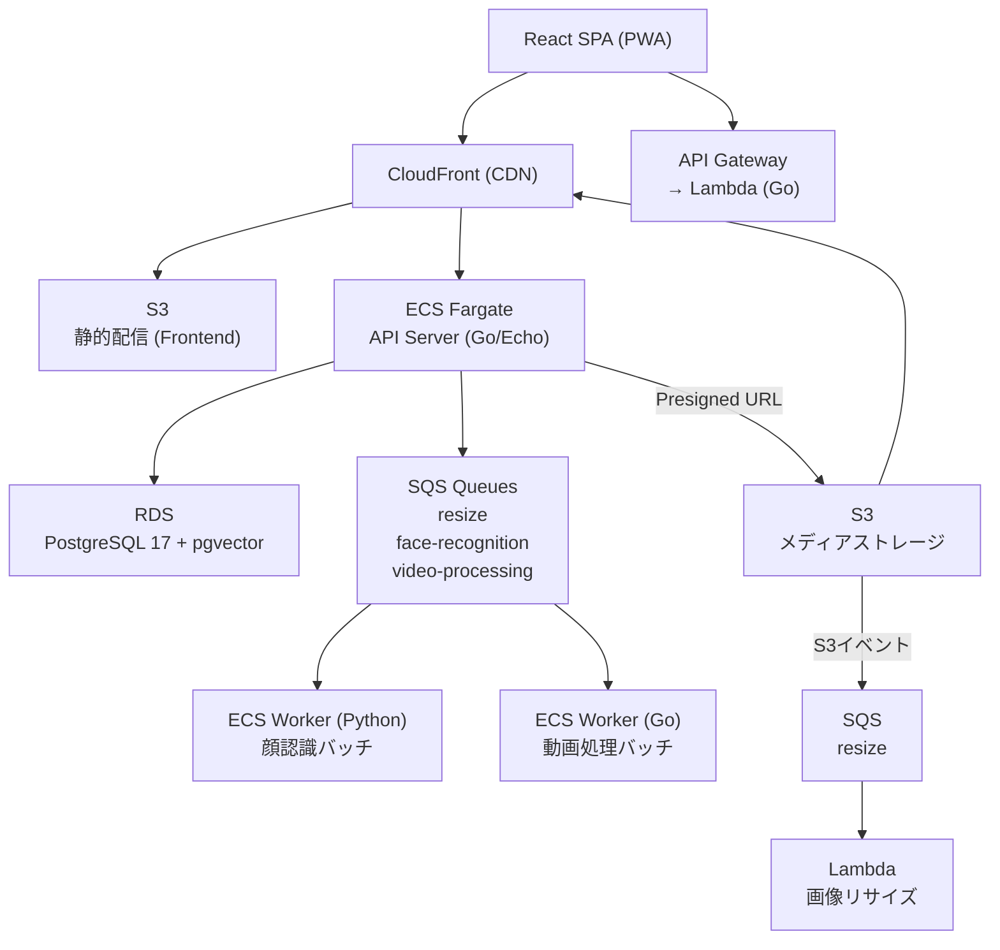
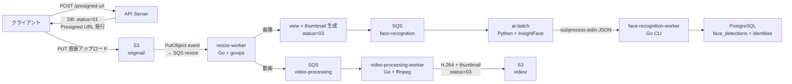

# YUNO — 家族写真共有プラットフォーム

家族の写真・動画を安全に共有し、AI による顔認識で人物ごとに検索できるプライベートフォトプラットフォーム。

---

## 技術スタック

| レイヤー      | 技術                                                                                                   |
| ------------- | ------------------------------------------------------------------------------------------------------ |
| **Backend**   | Go 1.24, Echo v4, sqlc, golang-migrate, JWT, govips, FFmpeg                                            |
| **Frontend**  | React 18, TypeScript, Vite, TanStack Query, React Hook Form, Zod, Tailwind CSS, PWA                    |
| **AI**        | Python 3, InsightFace (ONNX), OpenCV                                                                   |
| **Infra**     | Terraform, AWS (ECS Fargate / Lambda / S3 / CloudFront / SQS / RDS / Route53 / ACM / CloudWatch / SSM) |
| **Local Dev** | Docker Compose, MinIO, ElasticMQ, PostgreSQL 17 + pgvector                                             |

---

## システムアーキテクチャ



### ローカル開発環境との対応

| 本番 (AWS)     | ローカル              |
| -------------- | --------------------- |
| S3             | MinIO (S3互換)        |
| SQS            | ElasticMQ (SQS互換)   |
| RDS PostgreSQL | Docker PostgreSQL     |
| ECS Worker     | Docker Compose Worker |

Storage・Queue を Interface 化しているため、ローカル／本番の切り替えは環境変数のみで完結する。

---

## バックエンド設計

### Clean Architecture

```
Handler (HTTP) → Service (ビジネスロジック) → Store (データアクセス) → DB (sqlc生成コード)
```

責務を明確に分離することで、テスト容易性と変更への耐性を確保している。

### 型安全なクエリ（sqlc）

SQL を直接記述し、sqlc で Go コードを自動生成する。  
ORM のリフレクションを使わず、コンパイル時に型の整合性が保証されるためランタイムエラーを排除できる。

### DB インデックス設計

```sql
-- 完了済みメディアのみを対象とした Partial Index
CREATE INDEX idx_media_items_album ON media_items (album_id, taken_at DESC)
  WHERE upload_status = '03';

-- アルバム権限検索用 複合インデックス
CREATE INDEX idx_album_groups_permissions ON album_groups_permissions (group_id, permission)
  INCLUDE (album_id);

-- 顔埋め込みの近傍検索用 IVFFlat インデックス
CREATE INDEX ON face_detections USING ivfflat (embedding vector_cosine_ops);
```

### マルチテナント設計

すべてのテーブルに `family_id` を持たせ、クエリレベルで家族間のデータを完全に分離している。  
アルバムには `album_groups_permissions` テーブルで Read / Write 権限を付与できる。

### 認証

- JWT（アクセストークン + リフレッシュトークン）
- LINE OAuth / Kakao OAuth 対応
- 招待トークン（有効期限付き）によるメンバー追加

---

## アップロードパイプライン

クライアントは API サーバーを経由せず S3 に直接アップロードし、Webhook で後続処理をトリガーする。



### 状態遷移

| コード | 状態       | 説明                               |
| ------ | ---------- | ---------------------------------- |
| `01`   | pending    | Presigned URL 発行済み、S3 待ち    |
| `02`   | processing | resize-worker 処理中               |
| `03`   | completed  | 処理完了（閲覧可能）               |
| `04`   | failed     | 処理失敗（状態リセットで再処理可） |

### 設計上のポイント

**DB 先行生成**: S3 アップロード前に `media_items(status=01)` を作成し、孤立ファイルを防ぐ。アップロード放棄レコードは定期 cleanup で削除。

**べき等性保証**: `client_upload_id` とファイルハッシュの二重チェックで、再送による重複登録を防ぐ。

**ML と DB の分離**: Python (InsightFace) が顔検出・埋め込み計算を担当し、Go CLI が DB 書き込みと S3 アップロードを担当。それぞれ独立してスケール可能。

### S3 バケット構造

```
yuno-media-bucket/
├── original/    ← クライアント Presigned PUT 対象（公開読み取り不可）
├── view/        ← 2048px WebP（CloudFront OAC のみ読み取り可）
├── thumbnail/   ← 512px WebP（同上）
├── video/       ← H.264 MP4（同上）
└── identities/  ← 顔クロップ 512×512 WebP（同上）
```

---

## インフラ構成と設計判断

### ECS Fargate — API サーバー・Worker

API サーバーはコールドスタートが許容できないため、常時稼働の ECS Fargate を選択した。  
顔認識 Worker・動画処理 Worker も 1 リクエストあたりの処理時間が長く Lambda の実行時間制限に収まらないため、同様に ECS に配置している。

### Lambda — 画像リサイズ

S3 へのアップロード完了をトリガーに起動するイベント駆動の処理。  
アイドル時のコストが発生せず、バースト的なアップロードにも自動でスケールするため Lambda が最適だった。

### SQS — 非同期ジョブキュー

顔認識・動画処理はレイテンシが大きく、アップロード API のレスポンスに含めることができない。  
SQS を挟んで非同期化することで以下を実現している：

- アップロード API の応答速度を維持
- Worker の失敗時に自動リトライ（Visibility Timeout）
- 一定回数失敗したジョブを DLQ に隔離しデータ損失を防止

### S3 + CloudFront — メディアストレージ + CDN

Presigned URL を発行することで、メディアファイルの送受信が API サーバーを経由しない。  
API サーバーの負荷とコストを削減しつつ、CloudFront により日本国内ユーザーへの配信レイテンシを改善している。

### pgvector — ベクトル検索

PostgreSQL の拡張である pgvector を採用し、既存 DB 内で 512 次元の顔埋め込みベクトルを管理している。

### Terraform — IaC

```
infra/
├── environments/
│   └── production/    # 本番環境エントリポイント
└── modules/
    ├── ecs/           # ECS タスク定義・サービス
    ├── lambda/        # Lambda 関数
    ├── s3/            # メディア・フロントエンド
    ├── cloudfront/    # CDN
    ├── sqs/           # キュー
    ├── iam/           # 最小権限ロール
    ├── api_gateway/   # HTTP API
    ├── cloudwatch/    # ログ・アラート
    └── ssm/           # パラメータストア
```

- モジュール分割により、サービス単体の変更が他に影響しない構造
- S3 バックエンドで tfstate をリモート管理（チーム開発・CI/CD 対応）
- SSM Parameter Store で機密情報を管理し、リポジトリに環境変数ファイルを含めない

---

## AI 顔認識パイプライン

```
写真アップロード
    → S3 保存
    → Lambda (サムネイル生成)
    → API Server が SQS に顔認識ジョブを発行
    → Python Worker が SQS からメッセージを受信
    → InsightFace (ONNX) で顔検出 → 512次元埋め込みを生成
    → PostgreSQL (pgvector) に保存
    → フロントエンドでコサイン類似度検索が可能に
```

- **InsightFace**: ONNX 形式のモデルで高精度な顔検出と特徴量抽出
- **pgvector IVFFlat**: 大量の顔埋め込みに対する近傍検索を効率化
- **Identity**: 人物ごとに複数の顔画像サンプルを登録し、平均ベクトルで検索精度を向上

---

## フロントエンド設計

### Feature-based アーキテクチャ

```
src/
├── page/        # ルートに対応する薄いラッパー
├── feature/     # ドメイン単位 (auth / home / search / upload / settings / ...)
│   └── <domain>/
│       ├── components/
│       ├── hooks/
│       └── types/
├── components/  # 共通 UI コンポーネント (Radix / shadcn)
├── service/     # API 呼び出し関数
└── lib/         # Axios インスタンス・React Query クライアント
```

ドメインをまたぐ依存を排除し、機能追加時の影響範囲を局所化している。

### サーバー状態管理（TanStack Query）

API レスポンスのキャッシュ・再フェッチ・楽観的更新を TanStack Query で一元管理している。  
カスタムフックで各ドメインのデータ取得ロジックをカプセル化している。

### その他

- **PWA 対応**: Workbox によるオフラインキャッシュ
- **多言語対応**: i18next で日本語 / 韓国語を切り替え
- **フォームバリデーション**: React Hook Form + Zod でスキーマ駆動のバリデーション

---

## ローカル開発環境

```bash
# 全サービス起動（PostgreSQL / MinIO / ElasticMQ / Worker 含む）
docker compose up -d

# DB マイグレーション
make migrate

# シードデータ投入
make seed

# sqlc コード再生成（スキーマ変更後）
make sqlc
```

本番と同一のインターフェースで動作するため、ローカルで確認した動作が本番でも再現される。

---

## ディレクトリ構成

```
yuno/
├── server/          # Go + Echo (Backend API)
│   ├── cmd/
│   │   ├── api/                     # メイン API サーバー
│   │   ├── lambda/api/              # AWS Lambda エンドポイント
│   │   ├── video-processing-worker/ # 動画処理ワーカー
│   │   └── resize/                  # 画像リサイズ (Webhook)
│   ├── internal/
│   │   ├── api/handlers/            # HTTP ハンドラー
│   │   ├── services/                # ビジネスロジック
│   │   ├── store/                   # データアクセス層
│   │   └── db/                      # sqlc 生成コード
│   └── db/migrations/               # SQL マイグレーション
├── front/           # React + TypeScript (SPA)
│   └── src/
│       ├── feature/ # ドメイン別ロジック
│       ├── page/    # ルートページ
│       └── components/
├── ai/              # Python (顔認識バッチ)
│   └── src/
│       ├── batch/   # SQS メッセージ処理
│       └── service/ # InsightFace ラッパー
└── infra/           # Terraform (AWS)
    ├── environments/production/
    └── modules/
```
