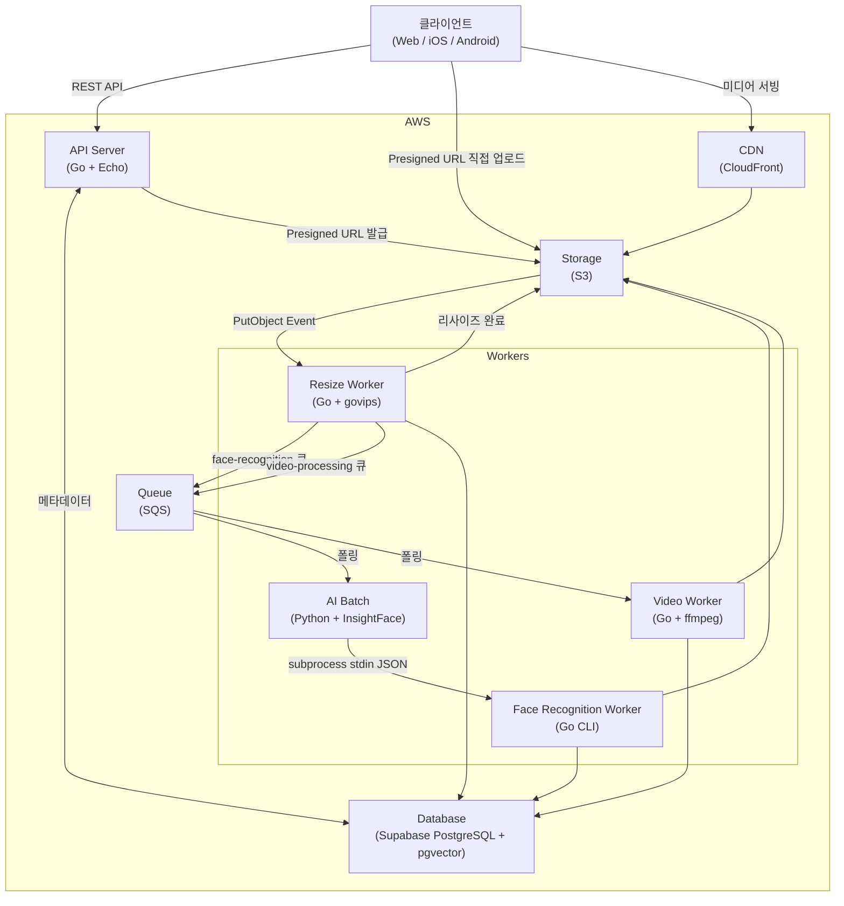

# 📘 System Architecture Overview

## 1. Introduction

### 프로젝트 목적

YUNO는 가족 단위의 사진·동영상을 공유하고, 얼굴 인식 기반으로 자동 분류하는 미디어 관리 플랫폼이다.
단순한 앨범 공유를 넘어, 가족 구성원의 얼굴을 자동으로 인식하고 인물별 검색 및 필터링을 제공한다.
동영상 업로드 및 재인코딩도 지원한다.

### 대상 사용자

- **가족 단위**: 부모/자녀가 같은 Family에 속해 사진·동영상을 공유
- **멀티 디바이스**: Web, iOS, Android에서 동일한 경험 제공
- **비기술 사용자**: 업로드 후 자동 처리, 별도 조작 없이 얼굴 분류 완료

### 설계 목표

| 목표                       | 내용                                                   |
| -------------------------- | ------------------------------------------------------ |
| **비용 최소화**            | 유휴 시간 비용 최소화, Serverless 기반 설계            |
| **단계적 확장**            | 개인 운용 → 실 서비스 전환 시 컴포넌트 교체만으로 대응 |
| **클라우드 종속성 최소화** | 인터페이스 추상화로 AWS → 홈서버 이전 가능한 구조      |
| **데이터 무결성**          | 미디어 처리 실패 시 재처리 가능, 고아 파일 방지        |
| **역할 분리**              | ML 추론(Python)과 DB/스토리지 처리(Go) 명확히 분리     |

---

## 2. High-Level Architecture

### 전체 아키텍처 다이어그램



### 주요 컴포넌트

| 컴포넌트                    | 기술                                    | 역할                                                                    |
| --------------------------- | --------------------------------------- | ----------------------------------------------------------------------- |
| **API Server**              | Go + Echo (Lambda 어댑터)               | REST API, Presigned URL 발급                                            |
| **Resize Worker**           | Go + govips (Lambda function)           | S3 PutObject Event 수신(로컬: MinIO Webhook), 이미지 리사이즈, SQS 발행 |
| **AI Batch**                | Python + InsightFace                    | SQS 폴링, 얼굴 감지·임베딩 계산, Go CLI 호출                            |
| **face-recognition-worker** | Go CLI 바이너리                         | identity 매칭, face_detections INSERT, 얼굴 크롭                        |
| **Video Worker**            | Go + ffmpeg                             | SQS 폴링, 동영상 리사이즈·썸네일 추출                                   |
| **Queue**                   | SQS (로컬: ElasticMQ)                   | face-recognition / video-processing 큐                                  |
| **Database**                | Supabase PostgreSQL 17 + pgvector       | 메타데이터, 벡터 검색                                                   |
| **Storage**                 | S3 (로컬: MinIO)                        | 미디어 파일 저장                                                        |
| **CDN**                     | CloudFront + OAC                        | 미디어 파일 서빙                                                        |

---

## 3. Request Flow

> 업로드 시퀀스 및 상태 전이 상세: [02-upload-pipeline.md](02-upload-pipeline.md)

### 조회 흐름

```
GET /media-item?from=...&to=...
    └─ upload_status = '03' (completed)인 항목만 반환
    └─ media_files JOIN으로 thumbnail/view/video URL 포함

GET /media-item/search?identity_ids=[1,2]
    └─ face_detections JOIN으로 특정 인물 필터링
    └─ 페이지네이션: cursor 기반
```

> AI 처리 상세 (Python+Go 하이브리드, subprocess 인터페이스): [02-upload-pipeline.md §7](02-upload-pipeline.md)

---

## 4. Multi-Tenancy Strategy

### family_id 기반 설계

```
families
   └─ groups (family 내 그룹)
       └─ users
           └─ albums
               └─ media_items
                   └─ media_files
                   └─ face_detections
                       └─ identities (family 내 인물)
```

### 데이터 격리 전략

| 레이어            | 격리 방법                                                   |
| ----------------- | ----------------------------------------------------------- |
| **API**           | JWT에서 family_id 추출, 모든 쿼리에 family_id 조건 포함     |
| **앨범 접근**     | `album_groups_permissions` 테이블로 그룹별 R/W 권한 관리    |
| **S3 경로**       | `{familyId}/` prefix로 논리적 분리                          |
| **pgvector 검색** | `WHERE family_id = $1` 조건으로 벡터 검색 범위 제한         |
| **Advisory Lock** | `family_id` 해시 기반 잠금으로 동시 identity 생성 충돌 방지 |

---

---
