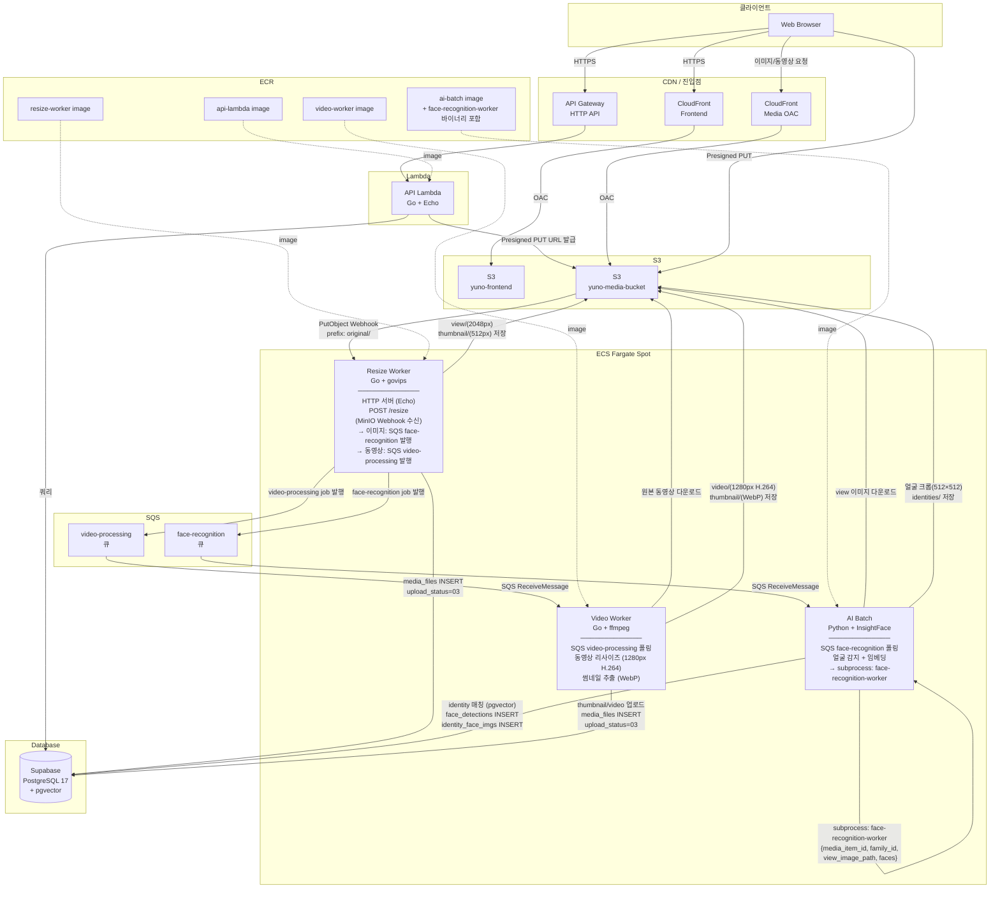
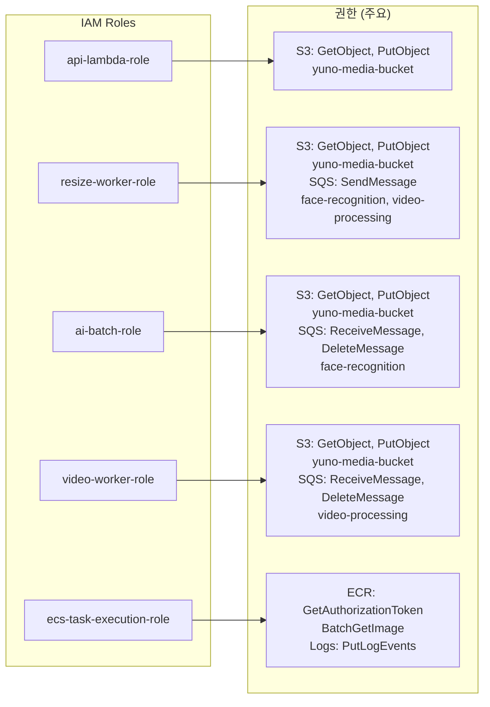

# AWS 인프라 구성도

> Phase 1 기준 (개인 운용 — VPC 없음, Supabase DB, ECS On-demand)

---

## 1. 전체 시스템 구성

---

## 2. 업로드 파이프라인

> 이미지/동영상 업로드 시퀀스 상세: [02-upload-pipeline.md](02-upload-pipeline.md)
>
> 컴포넌트 역할 요약: [01-system-architecture-overview.md §2](01-system-architecture-overview.md)
>
> S3 버킷 구조: [02-upload-pipeline.md §10](02-upload-pipeline.md)

---

## 3. IAM 권한 구조

---
