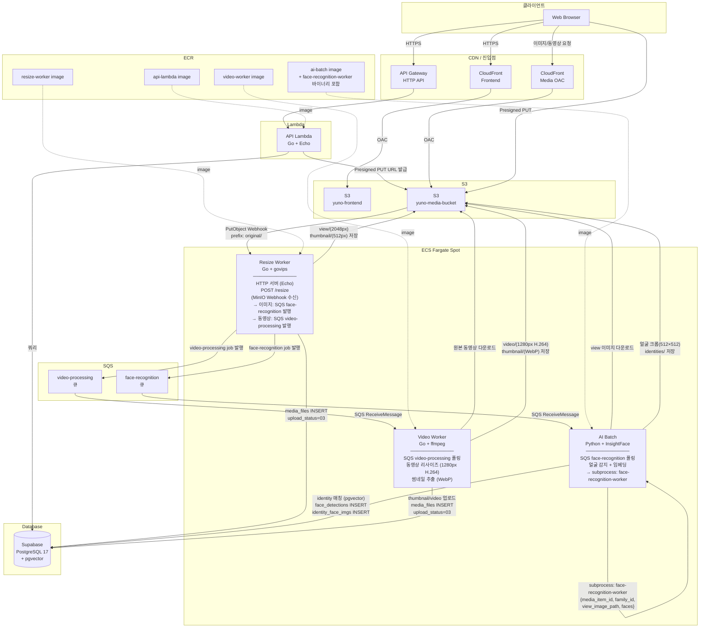
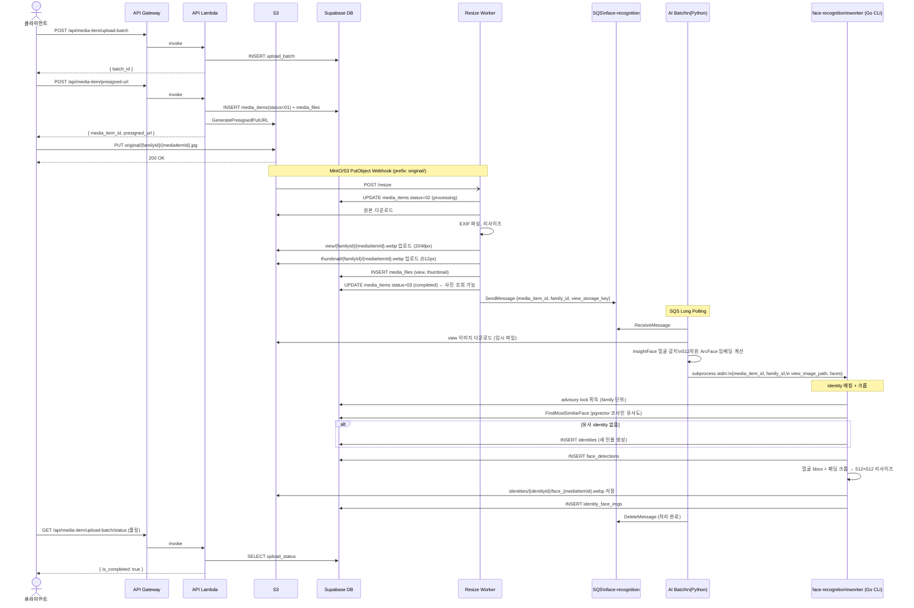
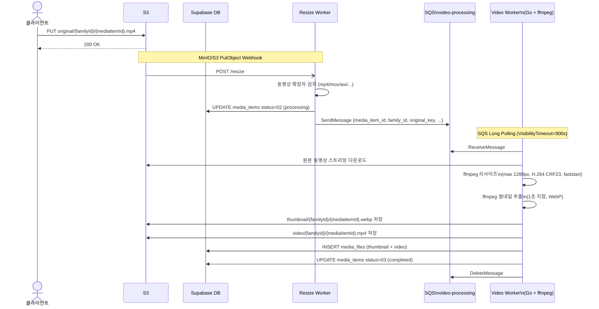
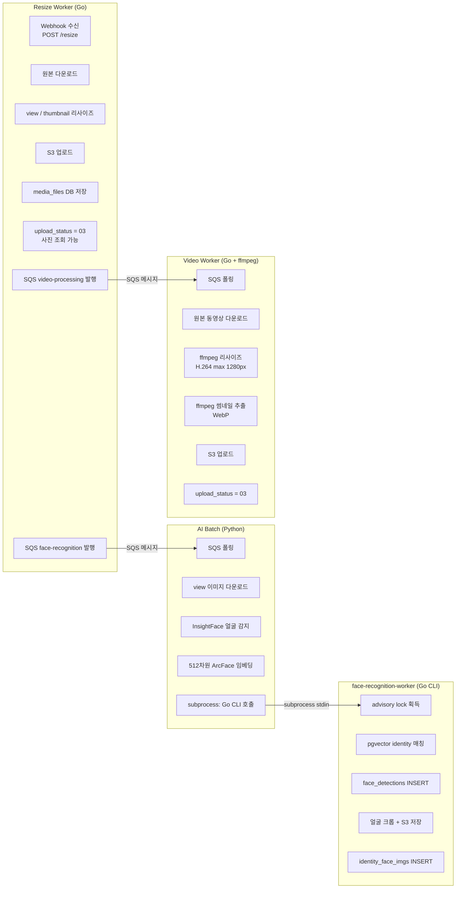
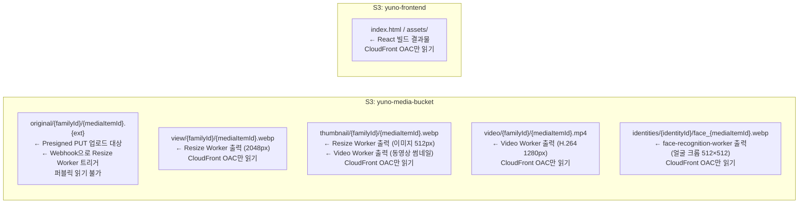
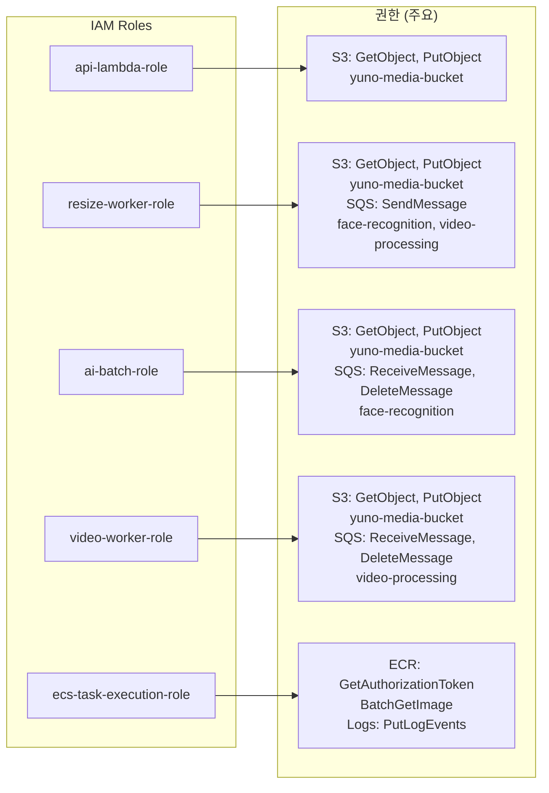

# AWS 인프라 구성도

> Phase 1 기준 (개인 운용 — VPC 없음, Supabase DB, ECS On-demand)

---

## 1. 전체 시스템 구성

---

## 2. 이미지 업로드 파이프라인 상세

---

## 3. 동영상 업로드 파이프라인 상세

---

## 4. 역할 분담 요약

---

## 5. S3 버킷 구조

---

## 6. IAM 권한 구조

---
