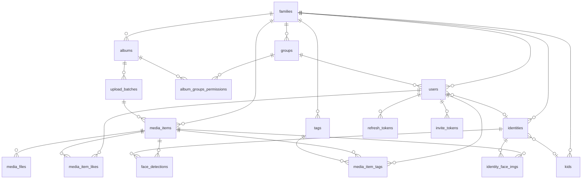

# 📘 Data Model Design

## 1. Design Principles

### 멀티테넌시

모든 데이터는 `family_id`를 통해 가족 단위로 격리된다. 조회 쿼리에는 항상 `WHERE family_id = $1` 조건이 포함되며, pgvector 벡터 검색도 동일한 조건으로 범위를 제한한다.

### 정합성 우선

미디어 처리 파이프라인은 "DB 선 생성 → S3 업로드 → Worker 처리" 순서로 진행된다. 처리 시작 전에 레코드가 존재하므로, Worker 실패 시 상태(`upload_status`)를 기반으로 재처리가 가능하다. 고아 파일(S3에는 있지만 DB에 없는 파일) 발생을 구조적으로 방지한다.

### 조회 최적화

- `taken_at` 기반 날짜 범위 쿼리가 주 조회 패턴이므로 복합 인덱스를 적극 활용한다.
- `upload_status = '03'` (completed) 조건은 Partial Index로 처리해 인덱스 크기를 줄인다.
- LATERAL 조인으로 `media_files`를 조회할 때 Index-Only Scan이 가능하도록 INCLUDE 컬럼을 지정한다.

---

## 2. ERD

---

## 3. Core Tables

### families

가족 전체를 나타내는 최상위 테넌트 단위다. 모든 데이터는 이 테이블을 루트로 귀속된다.

| 컬럼         | 타입      | 설명            |
| ------------ | --------- | --------------- |
| `id`         | UUID      | PK, 가족 식별자 |
| `created_at` | TIMESTAMP | 생성일시        |
| `updated_at` | TIMESTAMP | 수정일시        |

---

### groups

가족 내 소속 단위다 (예: 아빠 쪽, 엄마 쪽). 앨범 접근 권한(`album_groups_permissions`)의 주체가 된다. 가족당 관리자 그룹(`is_admin = TRUE`)은 1개만 허용된다.

| 컬럼        | 타입         | 설명             |
| ----------- | ------------ | ---------------- |
| `id`        | SERIAL       | PK               |
| `family_id` | UUID         | 소속 가족        |
| `is_admin`  | BOOLEAN      | 관리자 그룹 여부 |
| `name`      | VARCHAR(255) | 그룹 이름        |

**인덱스**

- `idx_groups_family_id` — 가족별 그룹 목록 조회
- `idx_groups_family_id_is_admin` (UNIQUE Partial) — 가족당 관리자 그룹 1개 제약

---

### users

서비스 이용자다. LINE/Kakao OAuth 또는 자체 계정으로 가입하며, `family_id` + `group_id`로 소속을 가진다. 자신의 얼굴 `identity_id`와 연결될 수 있다.

| 컬럼               | 타입         | 설명                            |
| ------------------ | ------------ | ------------------------------- |
| `id`               | UUID         | PK                              |
| `family_id`        | UUID         | 소속 가족                       |
| `group_id`         | INTEGER      | 소속 그룹                       |
| `identity_id`      | INTEGER      | 연결된 신원 (nullable)          |
| `provider`         | VARCHAR(50)  | OAuth 제공자 (`line` / `kakao`) |
| `provider_user_id` | VARCHAR(255) | 제공자 측 사용자 ID             |
| `family_title`     | VARCHAR(20)  | 가족 칭호 (엄마, 아빠 등)       |

**인덱스**

- `idx_users_provider_user` (UNIQUE Partial) — OAuth 중복 가입 방지

---

### albums

미디어를 묶는 단위다. `is_common = TRUE`인 앨범은 가족 내 전체 공개이며 가족당 1개만 존재한다. 일반 앨범은 `album_groups_permissions`로 그룹별 R/W 권한을 제어한다.

| 컬럼        | 타입         | 설명           |
| ----------- | ------------ | -------------- |
| `id`        | UUID         | PK             |
| `family_id` | UUID         | 소속 가족      |
| `is_common` | BOOLEAN      | 공통 앨범 여부 |
| `name`      | VARCHAR(255) | 앨범 이름      |

**인덱스**

- `idx_albums_family_id_is_common` (UNIQUE Partial) — 가족당 공통 앨범 1개 제약

---

### upload_batches

한 번의 업로드 세션을 나타낸다. 여러 미디어를 한 번에 올릴 때 배치 단위로 묶어 조회·관리를 용이하게 한다.

| 컬럼        | 타입      | 설명        |
| ----------- | --------- | ----------- |
| `id`        | SERIAL    | PK          |
| `album_id`  | UUID      | 대상 앨범   |
| `upload_at` | TIMESTAMP | 업로드 일시 |

---

### media_items

사진·동영상 1건을 나타내는 핵심 테이블이다. 처리 파이프라인 전반의 상태를 `upload_status`로 추적한다.

| 컬럼                       | 타입       | 설명                  |
| -------------------------- | ---------- | --------------------- |
| `id`                       | UUID       | PK                    |
| `family_id`                | UUID       | 소속 가족             |
| `album_id`                 | UUID       | 소속 앨범             |
| `upload_batch_id`          | INTEGER    | 업로드 배치           |
| `upload_status`            | VARCHAR(2) | 처리 상태 (아래 참고) |
| `taken_at`                 | TIMESTAMP  | 촬영 일시 (EXIF 기반) |
| `taken_location_latitude`  | DOUBLE     | 촬영 위도             |
| `taken_location_longitude` | DOUBLE     | 촬영 경도             |

**upload_status 상태값**

| 값   | 의미                                           |
| ---- | ---------------------------------------------- |
| `01` | pending — Presigned URL 발급 완료, 업로드 대기 |
| `02` | processing — Worker 처리 중                    |
| `03` | completed — 처리 완료, 조회 가능               |
| `04` | failed — 처리 실패                             |
| `05` | duplicate — 중복 감지                          |

**인덱스**

- `idx_media_items_album_id_taken_at_completed` (Partial) — `upload_status = '03'` 조건 고정, `taken_at DESC` 정렬 최적화
- `idx_media_items_family_year_month` — 날짜 범위 조회 (연/월 단위 파티셔닝 대체)
- `idx_media_items_upload_status` — 재처리 대상(`04`) 탐색

---

### media_files

`media_items` 1건에 대응하는 실제 파일 레코드다. 하나의 미디어 아이템은 역할(`role`)에 따라 여러 파일을 가진다.

| 컬럼            | 타입         | 설명                  |
| --------------- | ------------ | --------------------- |
| `id`            | SERIAL       | PK                    |
| `media_item_id` | UUID         | 소속 미디어 아이템    |
| `role`          | VARCHAR(2)   | 파일 역할 (아래 참고) |
| `storage_key`   | VARCHAR(512) | S3 저장 경로          |
| `width`         | INTEGER      | 가로 크기(px)         |
| `height`        | INTEGER      | 세로 크기(px)         |

**role 값**

| 값   | 의미                              |
| ---- | --------------------------------- |
| `01` | original — 원본 파일              |
| `02` | thumbnail — 썸네일 (512px)        |
| `03` | view — 조회용 리사이즈본 (2048px) |
| `04` | live — Live Photo 영상 파트       |

**인덱스**

- `idx_media_files_media_item_id_role` INCLUDE(`storage_key`, `width`, `height`) — LATERAL 조인 시 Index-Only Scan
- `idx_media_files_storage_key` — Resize Worker의 storage_key → media_item_id 역조회

---

### identities

가족 구성원의 "얼굴 신원"을 나타낸다. `users`(가입 멤버) 또는 `kids`(미가입 아이)와 1:1로 연결된다. 실제 임베딩은 `face_detections`에 분산 저장되며, 신원 매칭 시 동적으로 평균 벡터를 계산한다.

| 컬럼        | 타입   | 설명      |
| ----------- | ------ | --------- |
| `id`        | SERIAL | PK        |
| `family_id` | UUID   | 소속 가족 |

**인덱스**

- `idx_identities_family_id` — 가족 내 신원 목록 조회

---

### face_detections

이미지 1장에서 감지된 얼굴 1개를 나타낸다. ArcFace 512차원 임베딩과 이미지 내 위치(bounding box)를 저장한다.

| 컬럼                             | 타입        | 설명                   |
| -------------------------------- | ----------- | ---------------------- |
| `id`                             | SERIAL      | PK                     |
| `media_item_id`                  | UUID        | 원본 미디어            |
| `identity_id`                    | INTEGER     | 매칭된 신원            |
| `location_top/right/bottom/left` | INTEGER     | 얼굴 위치 (px)         |
| `embedding`                      | vector(512) | ArcFace 512차원 임베딩 |

**인덱스**

- `idx_face_detections_embedding` (hnsw, cosine) — 벡터 유사도 검색
- `idx_face_detections_identity_id_media_item_id` — 인물별 사진 필터링 (EXISTS 서브쿼리 최적화)

---

### upload_batches

한 번의 업로드 세션에서 여러 미디어를 묶는 단위다.

---

## 4. Vector Search Design

### pgvector 선택 이유

- PostgreSQL 내에서 벡터 검색과 메타데이터 필터링(`family_id`, `identity_id`)을 단일 쿼리로 처리할 수 있어, 별도 벡터 DB 없이도 충분한 성능을 낸다.
- 현재 트래픽 규모(소규모 가족 단위)에서는 외부 벡터 DB의 운영 비용 대비 이점이 없다.

### 임베딩 차원

- **512차원** — InsightFace `buffalo_s` 모델의 ArcFace 출력 차원.

### Identity 평균 벡터 전략

`identities` 테이블에는 임베딩 컬럼이 없다. 신원 매칭은 다음 방식으로 동작한다:

1. 신규 얼굴 임베딩이 들어오면 해당 `family_id`의 모든 `face_detections`를 pgvector로 코사인 유사도 검색
2. 임계값(0.5) 이상인 가장 가까운 `identity_id`를 선택
3. 일치하는 신원이 없으면 새 `identity` 생성

이 전략은 각 감지 시점의 임베딩을 원본 그대로 보존하므로, 향후 모델 교체 시 전체 재계산이 가능하다.

### Advisory Lock

동시에 여러 사진을 처리할 때 동일 인물에 대해 `identity`가 중복 생성되는 것을 방지하기 위해 `family_id` 해시 기반 PostgreSQL Advisory Lock을 사용한다.

---

## 5. Integrity Constraints

### UNIQUE 제약

| 테이블                     | 제약                                             | 내용                                  |
| -------------------------- | ------------------------------------------------ | ------------------------------------- |
| `users`                    | `idx_users_provider_user` (Partial)              | 같은 OAuth 제공자 + ID 중복 가입 방지 |
| `groups`                   | `idx_groups_family_id_is_admin` (Partial)        | 가족당 관리자 그룹 1개                |
| `albums`                   | `idx_albums_family_id_is_common` (Partial)       | 가족당 공통 앨범 1개                  |
| `album_groups_permissions` | `idx_album_groups_permissions_album_id_group_id` | 앨범-그룹-권한 조합 중복 방지         |
| `media_item_likes`         | `UNIQUE(media_item_id, user_id)`                 | 좋아요 중복 방지                      |

### Foreign Key 전략

- `media_files`, `face_detections`, `identity_face_imgs`, `media_item_likes`, `media_item_tags`는 `media_items` 삭제 시 `ON DELETE CASCADE`로 자동 삭제된다.
- `tags`는 `families` 삭제 시 `ON DELETE CASCADE`. `family_id = NULL`인 경우 시스템 프리셋 태그로 공유된다.
- 그 외 FK는 명시적 CASCADE 없이 참조 무결성만 보장한다.

### Soft Delete

현재 스키마에는 soft delete(`deleted_at`) 컬럼이 없다. 미디어 삭제 시 DB 레코드와 S3 파일을 함께 물리 삭제하는 전략을 취한다.
