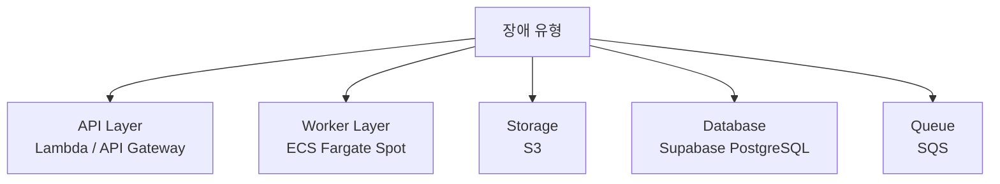

# 📘 Failure Scenario & Recovery Strategy

## 1. 운영 목표

| 목표 | 내용 |
|------|------|
| **자동 복구 우선** | 운영자 개입 없이 대부분의 장애가 자가 복구되어야 한다 |
| **데이터 손실 방지** | 처리 실패 시 메시지와 DB 레코드를 보존하여 재처리 가능 상태를 유지한다 |
| **부분 실패 허용** | 일부 미디어 처리가 실패해도 전체 서비스에 영향을 주지 않는다 |

---

## 2. Failure Categories



---

## 3. Scenario Breakdown

### 3.1 Worker Crash (ECS Task 중단)

**원인**
- Fargate Spot 선점 (AWS에서 용량 회수)
- OOM (메모리 초과)
- 애플리케이션 패닉

**감지 방법**
- ECS Task가 종료되면 SQS 메시지의 Visibility Timeout이 만료됨
- 메시지가 다시 Visible 상태로 전환 → 다음 폴링 시 재처리

**자동 복구 흐름**

```
ECS Task 중단
    ↓
SQS VisibilityTimeout 만료
    face-recognition: 300초 (5분)
    video-processing: 900초 (15분)
    ↓
메시지 재Visible → 재처리
    ↓ (maxReceiveCount 초과 시)
DLQ로 이동 (수동 조치 필요)
```

**SIGTERM 처리 (Graceful Shutdown)**

Fargate Spot 선점 시 SIGTERM → 30초 후 SIGKILL. 현재 처리 중인 job은 완료 후 종료, SQS 메시지는 삭제하지 않아 자동 재처리된다.

```python
def _handle_signal(sig, frame):
    global _running
    _running = False  # 루프 종료, 현재 job은 계속 처리
signal.signal(signal.SIGTERM, _handle_signal)
```

**수동 조치**
- DLQ 메시지 확인 → CloudWatch Logs에서 오류 내용 파악 → 수정 후 DLQ 메시지 메인 큐로 재전송

---

### 3.2 Processing Stuck (처리 중 정지)

**원인**: Worker가 처리 중(`upload_status = 02`)이지만 응답이 없는 경우

**감지 조건**

| 케이스 | timeout 기준 |
|--------|-------------|
| face-recognition Worker | SQS VisibilityTimeout 300초 |
| video-processing Worker | SQS VisibilityTimeout 900초 |

**자동 복구**: VisibilityTimeout 만료 → 메시지 재처리. DB의 `upload_status`는 Worker가 정상 완료 시에만 `03`으로 전환되므로 `02` 상태로 남은 레코드가 stuck 지표가 된다.

**수동 회수 쿼리**

```sql
-- 1시간 이상 processing 상태인 미디어 확인
SELECT id, upload_status, updated_at
FROM media_items
WHERE upload_status = '02'
  AND updated_at < NOW() - INTERVAL '1 hour';

-- 상태 초기화 (SQS 재발행 후 실행)
UPDATE media_items SET upload_status = '01'
WHERE id = '<media_item_id>';
```

---

### 3.3 S3 업로드 실패 (클라이언트 측)

**원인**: 네트워크 끊김, 클라이언트 앱 종료, Presigned URL 만료

**영향**
- DB에 `upload_status = 01` 레코드만 남음 (S3에 파일 없음)
- Resize Worker가 트리거되지 않으므로 stuck 없음

**처리 전략**
1. 클라이언트는 업로드 전 `upload_batch_id`를 기록
2. 앱 재기동 시 `GET /media-item/upload-batch/status`로 미완료 항목 확인
3. Presigned URL 만료 시 재발급 후 재업로드

**정리 전략**: 24시간 이상 `pending` 상태인 레코드는 고아 레코드로 판단, 주기적 cleanup 처리.

---

### 3.4 Resize Worker HTTP 수신 실패

**원인**: S3/MinIO Webhook 전달 실패, resize-worker 프로세스 다운

**현재 한계**: Webhook 방식은 SQS와 달리 자동 재시도 보장이 없다. 이벤트를 놓치면 수동 재처리가 필요하다.

**수동 재처리 방법**

```bash
# resize-worker의 /resize 엔드포인트를 직접 호출
curl -X POST http://<resize-worker>/resize \
  -H "Content-Type: application/json" \
  -d '{"storage_key": "original/<familyId>/<mediaItemId>.jpg"}'
```

---

### 3.5 Database 장애 (Supabase)

**Supabase Connection Pooler (PgBouncer, 포트 6543)** 를 통해 연결하므로 일시적 연결 불안정은 재시도로 흡수된다.

| 장애 유형 | 영향 | 복구 |
|-----------|------|------|
| 일시적 연결 불안정 | API 5xx 응답 | 클라이언트 재시도 |
| 읽기 장애 | 미디어 조회 불가 | Supabase 복구 대기 |
| 쓰기 장애 | 업로드 파이프라인 중단 | SQS 메시지 보존 → 복구 후 재처리 |

---

### 3.6 OOM 발생 (AI Batch)

**원인**: InsightFace 모델 (~2GB) + 다수 이미지 배치 처리 시 메모리 초과

**방지 전략**
- ECS Task: 4GB 메모리 할당
- 배치 처리 시 이미지별 임시 파일 처리 후 즉시 삭제
- 처리 완료 후 SQS DeleteMessage → OOM 발생 시 메시지 보존

**격리 전략**: OOM으로 Task 종료 시 SQS VisibilityTimeout 만료 후 재처리. 특정 이미지가 반복적으로 OOM을 유발하면 `maxReceiveCount` 초과 후 DLQ로 격리된다.

---

## 4. DLQ Strategy

### 큐별 설정

| 큐 | VisibilityTimeout | maxReceiveCount | DLQ 보존 기간 |
|----|-------------------|-----------------|--------------|
| `face-recognition` | 300초 (5분) | 3회 | 14일 |
| `video-processing` | 900초 (15분) | 2회 | 14일 |

### DLQ 처리 절차

```
1. CloudWatch Logs에서 실패 원인 파악
2. 코드 수정 or 환경 복구
3. DLQ 메시지 → 메인 큐로 재전송 (SQS 콘솔 or AWS CLI)
4. 처리 성공 확인
```

```bash
# DLQ 메시지 수 확인
aws sqs get-queue-attributes \
  --queue-url <dlq-url> \
  --attribute-names ApproximateNumberOfMessages

# DLQ → 메인 큐 재전송 (SQS 콘솔의 "Redrive" 기능 활용)
```

---

## 5. Disaster Recovery

### 백업 전략

| 데이터 | 백업 방법 | 복구 목표 |
|--------|-----------|-----------|
| PostgreSQL | Supabase 자동 백업 (Point-in-Time Recovery) | RPO: 수분, RTO: 수십분 |
| S3 미디어 파일 | S3 버저닝 (현재 비활성) | 삭제 시 복구 불가 |
| 설정값 | Terraform 코드로 재현 가능 | RTO: ~30분 |

### 복구 절차

**DB 복구 (Supabase PITR)**
1. Supabase 대시보드 → Backups → Point in Time Recovery
2. 복구 시점 선택
3. 복구 완료 후 연결 문자열 확인 (변경 없음)

**인프라 재구성**
```bash
cd infra/environments/production
terraform init
terraform apply
```
