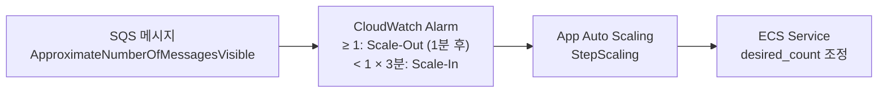

# 📘 Cost Analysis & Scaling Strategy

> Phase 1 기준 (소규모 가족 단위 운용, ap-northeast-1 리전)

---

## 1. 트래픽 가정

| 항목 | 가정값 |
|------|--------|
| 일 업로드 사진 수 | 50장 |
| 일 업로드 동영상 수 | 5개 |
| 평균 사진 원본 크기 | 5 MB |
| 평균 동영상 원본 크기 | 100 MB |
| 월 총 업로드 용량 (사진) | ~7.5 GB |
| 월 총 업로드 용량 (동영상) | ~15 GB |
| API 일 요청 수 | ~1,000건 |

---

## 2. AWS 서비스별 비용 분석

### Lambda (API Server)

| 항목 | 값 |
|------|-----|
| 실행 횟수 | ~30,000회/월 |
| 평균 실행 시간 | ~200ms |
| 메모리 | 512 MB |
| 예상 비용 | **~$0 (Free Tier 포함)** |

Lambda Free Tier: 월 100만 건 호출, 400,000 GB-초 무료.

---

### ECS Fargate Spot (Workers)

AI Batch와 Video Worker는 `desired_count = 0`에서 시작하며 SQS 메시지 유입 시 스케일아웃한다.

| 서비스 | CPU | 메모리 | 예상 월 가동 시간 | 예상 비용 |
|--------|-----|--------|------------------|-----------|
| ai-batch | 2 vCPU | 4 GB | ~10시간 | **~$1.5** |
| video-processing-worker | 2 vCPU | 4 GB | ~3시간 | **~$0.5** |

> Fargate Spot 단가 (ap-northeast-1): vCPU $0.01335/시간, GB $0.00146/시간  
> 2 vCPU + 4GB × 10시간 = ($0.0267 + $0.00584) × 10 ≈ $0.33 → Spot 할인 70% 적용 시 ~$0.1  
> 실제로 idle 시간이 없으므로 매우 낮음

---

### S3 (스토리지)

| 항목 | 계산 | 비용 |
|------|------|------|
| 스토리지 (원본 + 리사이즈본 × 3) | 월 22.5 GB 누적, 1년 후 ~270 GB | ~$6/월 |
| PUT 요청 (업로드) | ~1,650건/월 | ~$0.01 |
| GET 요청 (조회) | ~50,000건/월 | ~$0.02 |
| 데이터 전송 (CloudFront 경유) | CloudFront → S3: 무료 | $0 |

**S3 월 예상 비용: ~$6**

---

### CloudFront (CDN)

| 항목 | 계산 | 비용 |
|------|------|------|
| 데이터 전송 (클라이언트로) | 월 ~10 GB (뷰잉) | ~$0.85 |
| HTTP 요청 수 | ~100,000건/월 | ~$0.01 |

**CloudFront 월 예상 비용: ~$1**

---

### SQS

| 항목 | 값 |
|------|-----|
| 월 메시지 수 | ~1,700건 |
| 비용 | **~$0 (Free Tier: 100만 건 무료)** |

---

### API Gateway (HTTP API)

| 항목 | 값 |
|------|-----|
| 월 요청 수 | ~30,000건 |
| 비용 | **~$0.03** |

---

### Supabase (Database)

| 플랜 | 비용 | 포함 내용 |
|------|------|-----------|
| Free | $0 | 500 MB DB, 1GB 파일, 50,000 MAU |
| Pro | $25/월 | 8 GB DB, 100 GB 파일, PITR 백업 |

Phase 1은 Free 플랜으로 운용 가능. DB 용량 증가 시 Pro 전환.

---

## 3. 월간 비용 추정 (Phase 1)

| 서비스 | 월 비용 |
|--------|--------|
| Lambda | ~$0 |
| ECS Fargate Spot (AI + Video) | ~$2 |
| S3 | ~$6 |
| CloudFront | ~$1 |
| SQS | ~$0 |
| API Gateway | ~$0.03 |
| Supabase | $0 (Free) |
| **합계** | **~$9/월** |

---

## 4. 트래픽 증가 시나리오

| 배수 | 주요 변화 | 예상 비용 |
|------|-----------|-----------|
| 현재 (기준) | 가족 1~5명, 일 50장 | ~$9/월 |
| 5× | 일 250장, S3 1.3 TB/년 | ~$35/월 |
| 10× | 일 500장, S3 2.7 TB/년 | ~$70/월 |
| 50× | 가족 수십 팀 | ~$350/월 → 아키텍처 재검토 |

S3 스토리지가 비용의 대부분을 차지하므로, 규모 증가 시 원본 파일 수명주기 정책(오래된 원본 Glacier 이전)이 유효하다.

---

## 5. Scaling Strategy

### API Scaling (Lambda)

Lambda는 요청당 자동 스케일. 별도 설정 불필요. 동시 실행 제한(기본 1,000)은 현재 트래픽에서 도달하지 않는다.

### Worker Scaling (ECS Fargate + CloudWatch)

**AI Batch 스케일 정책**

| SQS 메시지 수 | 태스크 수 |
|--------------|-----------|
| 0 | 0 |
| 1 ~ 20 | 1 |
| 21 ~ 40 | 2 |
| 41+ | 3 |

**Video Worker 스케일 정책**

| SQS 메시지 수 | 태스크 수 |
|--------------|-----------|
| 0 | 0 |
| 1 ~ 10 | 1 |
| 11+ | 3 |

### DB Scaling (Supabase)

Supabase Pro는 읽기 복제본 추가 가능. 현재 트래픽에서는 단일 인스턴스로 충분하다. 쿼리 최적화(인덱스, LATERAL 조인)로 DB 부하를 최소화하는 전략을 우선한다.

---

## 6. Serverless vs Container 비교

| 항목 | Lambda (API) | ECS Fargate Spot (Workers) |
|------|-------------|---------------------------|
| 콜드스타트 | ~500ms | 30~60초 (모델 로드 포함) |
| 비용 모델 | 요청당 과금 | 가동 시간 과금 |
| 적합 워크로드 | 짧고 빈번한 요청 | 무거운 배치 처리 |
| 현재 사용 | API Server | AI Batch, Video Worker |

Workers를 Lambda로 전환하면 콜드스타트 문제와 15분 실행 제한이 있어 현재 구조에 적합하지 않다.

---

## 7. 비용 최적화 포인트

| 항목 | 현재 | 최적화 방안 |
|------|------|-------------|
| S3 원본 파일 | 무기한 보존 | 1년 후 Glacier 이전 (비용 80% 절감) |
| ECS Container Insights | 비활성 (Phase 1) | 필요 시 활성화 (~$2/월 추가) |
| CloudFront 캐시 | 기본 설정 | TTL 최적화로 S3 GET 요청 감소 |
| Fargate Spot | 활성 | Spot 중단 시 재처리 허용 구조 유지 |
