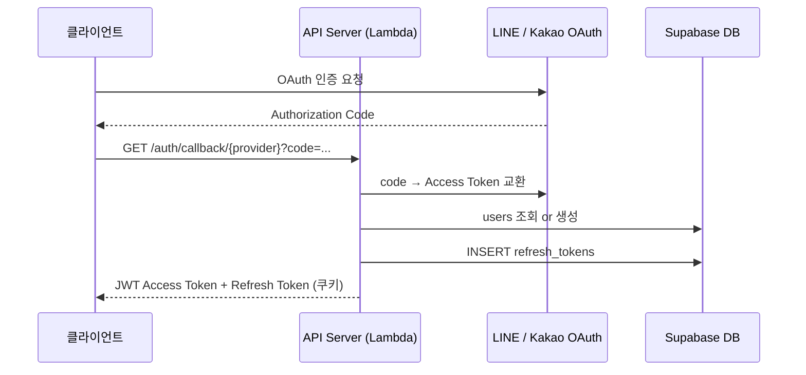

# 📘 Security & Multi-Tenancy Model

## 1. Authentication Model

### 인증 흐름



### 토큰 구조

| 토큰 | 저장 위치 | 유효 기간 | 내용 |
|------|-----------|-----------|------|
| Access Token (JWT) | localStorage (Web) / SecureStorage (Mobile) | 단기 (수십분~수시간) | `user_id`, `family_id`, `group_id` |
| Refresh Token | DB (`refresh_tokens` 테이블) | 장기 | 불투명 랜덤 문자열 |

### JWT Payload

```json
{
  "user_id": "uuid",
  "family_id": "uuid",
  "group_id": 1,
  "exp": 1234567890
}
```

모든 API 핸들러는 JWT에서 `family_id`를 추출하여 데이터 접근 범위를 제한한다. 클라이언트가 다른 `family_id`를 전달해도 JWT의 값이 우선 적용된다.

---

## 2. Authorization Model

### 계층 구조

```
Family
  └── Group (아빠 쪽 / 엄마 쪽 / ...)
        └── User
              └── Album 접근 권한 (album_groups_permissions)
```

### 앨범 접근 제어

| 앨범 유형 | 접근 범위 |
|-----------|-----------|
| `is_common = TRUE` (공통 앨범) | 같은 family의 모든 멤버 R/W |
| 일반 앨범 | `album_groups_permissions`에 명시된 group만 접근 |

```sql
-- 그룹이 읽기 권한을 가진 앨범만 조회
SELECT a.id FROM albums a
JOIN album_groups_permissions agp ON agp.album_id = a.id
WHERE agp.group_id = $1 AND agp.permission IN ('R', 'W')
  AND a.family_id = $2;
```

### 권한 코드

| 값 | 의미 |
|----|------|
| `R` | 읽기 전용 |
| `W` | 쓰기 (읽기 포함) |

---

## 3. Family Isolation Strategy

### 데이터 레이어 격리

모든 테이블에 `family_id` 컬럼이 있으며, 쿼리 조건에 반드시 포함된다. sqlc로 생성된 코드를 통해 타입 안전성이 보장된다.

| 레이어 | 격리 방법 |
|--------|-----------|
| **API** | JWT `family_id` 추출 → 모든 쿼리에 조건 포함 |
| **pgvector 검색** | `WHERE family_id = $1` 조건으로 벡터 검색 범위 제한 |
| **S3 경로** | `{familyId}/` prefix로 논리적 분리 |
| **Advisory Lock** | `family_id` 해시 기반 잠금으로 identity 생성 충돌 방지 |

### 크로스 패밀리 접근 방지

```go
// 핸들러에서 JWT의 family_id를 강제 적용
familyID := c.Get("family_id").(string)

// Store 레이어에서 family_id 조건 포함
mediaItems, err := store.GetMediaItemsByFamilyID(ctx, familyID, params)
```

---

## 4. Presigned URL Security

### 발급 구조

```
클라이언트 → API Server → S3 GeneratePresignedPutURL
                         ↓
           URL에 서명 포함 (AWS Signature V4)
                         ↓
클라이언트 → S3 PUT (직접 업로드, API 미경유)
```

### 보안 특성

| 항목 | 내용 |
|------|------|
| URL 유효 기간 | 단기 (기본 15분) |
| 업로드 경로 | `original/{familyId}/{mediaItemId}.{ext}` — JWT의 `familyId`로 고정 |
| 다른 경로 업로드 | 서명 불일치로 S3가 거부 |
| URL 유출 시 | 만료 후 무효, 업로드만 가능 (읽기 불가) |

### S3 접근 제어

| prefix | 접근 방법 |
|--------|-----------|
| `original/` | Presigned PUT만 허용, 퍼블릭 읽기 불가 |
| `view/`, `thumbnail/`, `video/`, `identities/` | CloudFront OAC만 읽기 허용 |

---

## 5. Data Access Control

### IAM 최소 권한 원칙

각 컴포넌트는 필요한 최소 권한만 부여된 전용 IAM Role을 사용한다.

| 컴포넌트 | S3 권한 | SQS 권한 |
|----------|---------|---------|
| API Lambda | GetObject, PutObject (Presigned URL 발급) | — |
| Resize Worker | GetObject, PutObject | SendMessage (face + video 큐) |
| AI Batch | GetObject, PutObject (identities/) | ReceiveMessage, DeleteMessage (face 큐) |
| Video Worker | GetObject, PutObject | ReceiveMessage, DeleteMessage (video 큐) |

### 환경변수 관리

민감한 값(DB 연결 문자열, OAuth Secret, JWT Secret)은 AWS SSM Parameter Store에 저장하고, ECS Task 실행 시 주입한다. `.env` 파일은 로컬 개발 전용이며 git에 커밋하지 않는다.

---

## 6. 인증 미들웨어

API Server의 모든 라우트(OAuth 콜백 제외)는 `AuthMiddleware`를 통과한다.

```
요청 → AuthMiddleware
         ↓ Authorization 헤더에서 JWT 추출
         ↓ 서명 검증 + 만료 확인
         ↓ user_id, family_id, group_id → Context 저장
         ↓ (실패 시 401 반환)
       Handler
```

---

## 7. Future: RLS (Row Level Security) 적용 가능성

현재는 애플리케이션 레이어에서 `family_id` 격리를 수행한다. Supabase는 PostgreSQL RLS를 지원하므로, DB 레벨에서 다음과 같이 추가 격리가 가능하다.

```sql
ALTER TABLE media_items ENABLE ROW LEVEL SECURITY;

CREATE POLICY family_isolation ON media_items
  USING (family_id = current_setting('app.family_id')::uuid);
```

현재 단계에서는 sqlc + 애플리케이션 레이어 격리가 충분하며, 멀티테넌시 요구사항이 강화될 경우 RLS를 추가 방어선으로 도입할 수 있다.
