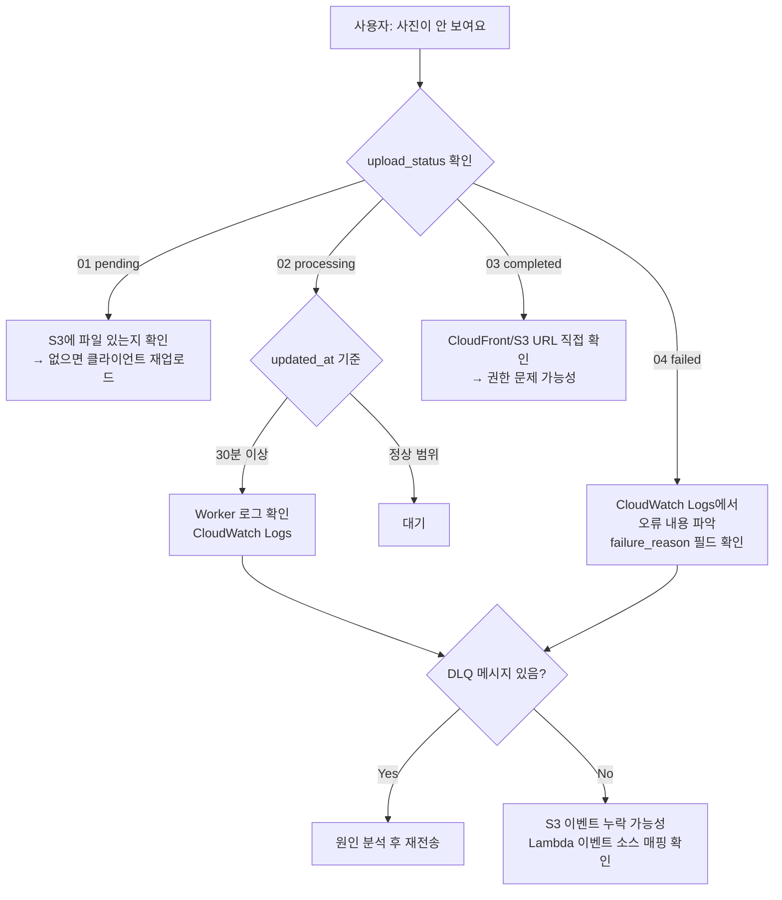

# 📘 Observability & Monitoring Design

## 1. Logging Strategy

### 로그 수집 구조

```
Lambda (API Server)         → CloudWatch Logs: /aws/lambda/yuno-api-{env}
Lambda (Resize Worker)      → CloudWatch Logs: /aws/lambda/yuno-resize-{env}
ECS AI Batch                → CloudWatch Logs: /ecs/yuno-ai-{env}
ECS Video Worker            → CloudWatch Logs: /ecs/yuno-video-{env}
```

모든 컴포넌트는 `awslogs` 드라이버(ECS) 또는 Lambda 자동 수집을 통해 CloudWatch Logs로 수집된다.

### 로그 보존 기간

| 로그 그룹                       | 보존 기간 |
| ------------------------------- | --------- |
| `/aws/lambda/yuno-api-{env}`    | 30일      |
| `/aws/lambda/yuno-resize-{env}` | 30일      |
| `/ecs/yuno-ai-{env}`            | 30일      |
| `/ecs/yuno-video-{env}`         | 30일      |

모든 로그 그룹은 Terraform `aws_cloudwatch_log_group`으로 명시적 관리되며, 보존 기간은 30일로 통일되어 있다.

### 로그 레벨 정책

| 레벨  | 사용 기준                                           |
| ----- | --------------------------------------------------- |
| DEBUG | DB 쿼리, 외부 API 요청·응답 상세 (local/dev 환경만) |
| INFO  | 정상 처리 완료, 상태 전이                           |
| WARN  | 재시도 발생, 부분 실패, 임계값 근접                 |
| ERROR | 처리 실패, DLQ 이동, 복구 불가 오류                 |

---

## 1-1. 구조화 로깅 (slog)

Go 1.21 표준 `log/slog`를 전면 사용한다. 기존 `log.Printf` / `log.Println`은 모두 교체 완료.  
CloudWatch Logs Insights에서 JSON 필드로 직접 필터·집계할 수 있다.

---

### 1-2. Logger 초기화

`internal/logger` 패키지로 앱 시작 시 한 번 초기화한다.  
이 시점에 **앱 전역 정적 필드** (`env`, `service`)를 기본 logger에 바인딩한다.  
이후 모든 `slog.Default()` 호출은 이 필드를 자동으로 포함한다.

```go
// internal/logger/logger.go
package logger

import (
    "log/slog"
    "os"
)

func Init(env, service string) {
    var handler slog.Handler
    opts := &slog.HandlerOptions{Level: slog.LevelInfo}
    if env == "local" || env == "dev" {
        opts.Level = slog.LevelDebug
        handler = slog.NewTextHandler(os.Stdout, opts)
    } else {
        handler = slog.NewJSONHandler(os.Stdout, opts)
    }
    slog.SetDefault(slog.New(handler).With(
        "env", env,
        "service", service,
    ))
}
```

각 진입점에서 `service` 이름을 지정해 호출한다.

```go
// internal/api/app.go  → "yuno-api"
logger.Init(viper.GetString("APP_ENV"), "yuno-api")

// cmd/lambda-resize/main.go  → "yuno-resize-worker"
logger.Init(viper.GetString("APP_ENV"), "yuno-resize-worker")

// cmd/face-recognition-worker/main.go  → "yuno-face-worker"
logger.Init(viper.GetString("APP_ENV"), "yuno-face-worker")
```

**출력 예시 (프로덕션 JSON):**

```json
{
  "time": "2026-05-19T10:00:00Z",
  "level": "INFO",
  "msg": "resize completed",
  "env": "prod",
  "service": "yuno-resize-worker",
  "layer": "worker",
  "component": "resize",
  "media_item_id": "abc-123"
}
```

---

### 1-3. Context를 통한 공통 필드 전파

요청마다 `request_id` (RequestIDWithConfig 미들웨어), 인증 후에는 `user_id` · `family_id`를 context에 심어  
하위 Service / Store 레이어가 별도 파라미터 없이 꺼내 쓴다.

```go
// internal/utils/log_context.go

// InjectAuthToContext는 인증된 사용자 정보를 로깅용으로 context에 심는다.
// Guard 미들웨어 이후 핸들러에서 호출한다.
func InjectAuthToContext(ctx context.Context, userID, familyID string) context.Context {
    ctx = context.WithValue(ctx, consts.RequestIDKey, GetRequestID(ctx))
    ctx = WithLogUserID(ctx, userID)
    ctx = WithLogFamilyID(ctx, familyID)
    return ctx
}

// LogAttrs는 context에서 공통 로그 필드(request_id, user_id, family_id)를 꺼내 반환한다.
func LogAttrs(ctx context.Context) []any {
    var attrs []any
    if v := GetRequestID(ctx); v != "" {
        attrs = append(attrs, slog.String("request_id", v))
    }
    if v, ok := ctx.Value(logUserIDKey).(string); ok && v != "" {
        attrs = append(attrs, slog.String("user_id", v))
    }
    if v, ok := ctx.Value(logFamilyIDKey).(string); ok && v != "" {
        attrs = append(attrs, slog.String("family_id", v))
    }
    return attrs
}
```

`request_id`는 `consts.RequestIDKey`로 context에 저장되며, `GetRequestID(ctx)`로 꺼낸다.  
`user_id` / `family_id`는 내부 타입(`logUserIDKey`, `logFamilyIDKey`)으로 저장해 외부 충돌을 방지한다.

---

### 1-4. 표준 필드 목록

모든 로그에는 아래 필드를 일관되게 사용한다.

| 필드            | 타입   | 설명                                                                 |
| --------------- | ------ | -------------------------------------------------------------------- |
| `request_id`    | string | Echo RequestIDWithConfig 미들웨어가 삽입                             |
| `user_id`       | string | 인증된 사용자 UUID                                                   |
| `family_id`     | string | 현재 요청의 가족 UUID                                                |
| `media_item_id` | string | 미디어 처리 파이프라인 추적 키                                       |
| `layer`         | string | `handler` / `service` / `worker` / `middleware` / `db`               |
| `component`     | string | 세부 컴포넌트명 (예: `"resize"`, `"resize_handler"`, `"media_item"`) |
| `op`            | string | 수행 중인 작업명 (예: `"batch_presign_upload"`)                      |
| `duration_ms`   | int64  | 처리 소요 시간 (ms)                                                  |
| `error`         | string | 오류 메시지 (ERROR 레벨에서만)                                       |

---

### 1-5. 레이어별 로깅 패턴

`layer` / `component` 필드는 **생성자에서 한 번만 바인딩**한다.  
`logger.Init()` 이후에 `slog.Default()`를 호출해야 `env` · `service`가 이미 포함된 logger를 받는다.

```
필드 바인딩 타이밍 요약

  logger.Init() 호출 시  →  env, service
  생성자(New*) 호출 시   →  layer, component
  각 로그 호출 시        →  op, media_item_id, duration_ms, error  (동적 값)
  context 전파           →  request_id, user_id, family_id
```

#### Handler

```go
type MediaItemHandler struct {
    log              *slog.Logger  // layer="handler", component="media_item" 고정
    mediaItemService *services.MediaItemService
}

func NewMediaItemHandler(svc *services.MediaItemService) *MediaItemHandler {
    return &MediaItemHandler{
        log:              slog.Default().With("layer", "handler", "component", "media_item"),
        mediaItemService: svc,
    }
}

func (con *MediaItemHandler) CreatePresignedUpload(c echo.Context) error {
    ctx := c.Request().Context()
    result, err := con.mediaItemService.CreatePresignedUpload(ctx, ...)
    if err != nil {
        con.log.ErrorContext(ctx, "create presigned upload failed", "error", err)
        return err
    }
    return c.JSON(200, result)
}
```

#### Service (Resize)

```go
type ResizeService struct {
    log *slog.Logger  // layer="worker", component="resize" 고정
    // ...
}

func NewResizeService(...) *ResizeService {
    return &ResizeService{
        log: slog.Default().With("layer", "worker", "component", "resize"),
        // ...
    }
}

func (s *ResizeService) ProcessResize(ctx context.Context, originalKey string) error {
    ok, err := s.mediaItemStore.UpdateMediaItemToProcessingIfPending(ctx, mediaItemID)
    if err != nil {
        s.log.ErrorContext(ctx, "status 업데이트 실패", "media_item_id", mediaItemID, "error", err)
        return err
    }
    if !ok {
        s.log.InfoContext(ctx, "duplicate event skipped", "media_item_id", mediaItemID)
        return nil
    }
    // ...
    s.log.InfoContext(ctx, "resize completed", "media_item_id", mediaItemID)
    return nil
}
```

#### Lambda Worker (Resize)

Lambda 핸들러는 생성자 패턴 없이 `slog.InfoContext` / `slog.ErrorContext`를 직접 사용한다.  
`logger.Init()`이 `init()`에서 호출되므로 `slog.Default()`에 `env` · `service`가 바인딩된 상태다.

```go
// cmd/lambda-resize/main.go
func init() {
    setting.SettingEnv()
    logger.Init(viper.GetString("APP_ENV"), "yuno-resize-worker")
    resizeSvc = worker.InitResize()
}

func handler(ctx context.Context, sqsEvent events.SQSEvent) error {
    for _, sqsRecord := range sqsEvent.Records {
        // ...
        slog.InfoContext(ctx, "S3 리사이즈 처리 시작", "key", key)
        if err := resizeSvc.ProcessResize(ctx, key); err != nil {
            slog.ErrorContext(ctx, "리사이즈 실패", "key", key, "error", err)
            return err
        }
    }
    return nil
}
```

#### MinIO Webhook Handler (로컬 개발용)

로컬 환경에서는 Lambda 대신 Echo 서버가 MinIO webhook을 수신한다.  
처리는 goroutine으로 비동기 실행된다.

```go
type ResizeHandler struct {
    log           *slog.Logger  // layer="worker", component="resize_handler" 고정
    resizeService *workerServices.ResizeService
}

func NewResizeHandler(svc *workerServices.ResizeService) *ResizeHandler {
    return &ResizeHandler{
        log:           slog.Default().With("layer", "worker", "component", "resize_handler"),
        resizeService: svc,
    }
}

func (h *ResizeHandler) HandleMinioEvent(c echo.Context) error {
    // ...
    h.log.InfoContext(ctx, "resize processing started", "key", originalKey)
    go func() {
        if err := h.resizeService.ProcessResize(context.Background(), originalKey); err != nil {
            h.log.Error("resize processing failed", "key", originalKey, "error", err)
        }
    }()
    return c.JSON(200, map[string]string{"status": "processing"})
}
```

#### Face Recognition Worker (CLI)

ECS에서 Python AI 서비스가 `cmd/face-recognition-worker` 바이너리를 stdin으로 실행한다.  
SQS consumer가 아닌 **CLI 프로세스** 방식이다.

```go
// cmd/face-recognition-worker/main.go
func main() {
    setting.SettingEnv()
    logger.Init(viper.GetString("APP_ENV"), "yuno-face-worker")

    var input cliInput
    if err := json.NewDecoder(os.Stdin).Decode(&input); err != nil {
        slog.Error("입력 파싱 실패", "error", err)
        os.Exit(1)
    }
    // ...
    if err := svc.ProcessFaces(ctx, input.ProcessFacesParams, input.Faces); err != nil {
        slog.Error("얼굴 인식 처리 실패", "error", err)
        os.Exit(1)
    }
}
```

#### Middleware (Error Handler)

```go
type ErrorHandler struct {
    log *slog.Logger  // layer="middleware", component="error" 고정
}

func NewErrorHandler() *ErrorHandler {
    return &ErrorHandler{
        log: slog.Default().With("layer", "middleware", "component", "error"),
    }
}

// 내부 에러 발생 시 request_id, file, line 정보를 포함해 로깅
e.log.ErrorContext(ctx, "internal error",
    "request_id", requestId,
    "file", internalError.File,
    "line", internalError.Line,
    "message", internalError.Message,
)
```

#### DB (query_logger)

`slog.DebugContext`를 사용해 프로덕션(INFO 레벨)에서는 출력되지 않는다.

```go
type queryLogger struct {
    log     *slog.Logger  // layer="db" 고정
    inner   DBTX
    enabled bool
}

func NewQueryLogger(inner DBTX, enabled bool) DBTX {
    if !enabled {
        return inner
    }
    return &queryLogger{
        log:     slog.Default().With("layer", "db"),
        inner:   inner,
        enabled: true,
    }
}

func (q *queryLogger) logQuery(ctx context.Context, query string, args ...interface{}) {
    q.log.DebugContext(ctx, "db query",
        "request_id", utils.GetRequestID(ctx),
        "query", strings.TrimSpace(query),
        "args", args,
    )
}
```

---

### 1-6. HTTP 요청 로깅 미들웨어

Echo 기본 logger 미들웨어 대신 slog 기반 커스텀 미들웨어를 사용한다.  
`request_id`는 상위에 등록된 `RequestIDWithConfig` 미들웨어가 context에 이미 심어둔다.

```go
// internal/api/middlewares/request_logger.go
func RequestLogger() echo.MiddlewareFunc {
    return func(next echo.HandlerFunc) echo.HandlerFunc {
        return func(c echo.Context) error {
            start := time.Now()
            req := c.Request()
            ctx := req.Context()

            err := next(c)

            slog.InfoContext(ctx, "http",
                "method", req.Method,
                "path", req.URL.Path,
                "status", c.Response().Status,
                "duration_ms", time.Since(start).Milliseconds(),
                "request_id", utils.GetRequestID(ctx),
                "ip", c.RealIP(),
            )
            return err
        }
    }
}
```

미들웨어 등록 순서 (`internal/api/app.go`):

1. `RequestIDWithConfig` — request_id를 `consts.RequestIDKey`로 context에 저장 (`/api/health` 제외)
2. `Recover` — 패닉 복구
3. `RequestLogger` — slog 기반 HTTP 요청 로깅
4. `LocaleMiddleware` — Accept-Language 기반 로케일
5. `ErrorHandler.Handler` — 에러 처리 및 HTTP 응답 변환

---

### 1-7. CloudWatch Logs Insights 쿼리 예시

slog JSON 출력 후 아래 쿼리로 필드 직접 필터·집계가 가능하다.

```
# 특정 media_item_id 전체 처리 흐름 추적
fields @timestamp, layer, component, duration_ms
| filter media_item_id = "<target-uuid>"
| sort @timestamp asc

# 최근 1시간 ERROR 로그 목록
fields @timestamp, layer, component, error, request_id
| filter level = "ERROR"
| sort @timestamp desc
| limit 50

# Resize Worker 처리 흐름 추적
fields @timestamp, msg, media_item_id, error
| filter service = "yuno-resize-worker"
| sort @timestamp desc
| limit 100
```

---

## 2. Metrics Definition

### SQS 핵심 메트릭

| 메트릭                               | 네임스페이스 | 용도                            |
| ------------------------------------ | ------------ | ------------------------------- |
| `ApproximateNumberOfMessagesVisible` | `AWS/SQS`    | 적체량 — Worker 스케일링 트리거 |
| `NumberOfMessagesSent`               | `AWS/SQS`    | 업로드 처리량                   |
| `ApproximateAgeOfOldestMessage`      | `AWS/SQS`    | 처리 지연 감지                  |

### ECS 핵심 메트릭

| 메트릭              | 네임스페이스 | 용도           |
| ------------------- | ------------ | -------------- |
| `DesiredCount`      | `AWS/ECS`    | 현재 태스크 수 |
| `MemoryUtilization` | `AWS/ECS`    | OOM 위험 감지  |
| `CPUUtilization`    | `AWS/ECS`    | 처리 부하 확인 |

### Lambda 핵심 메트릭

| 메트릭      | 용도                          |
| ----------- | ----------------------------- |
| `Duration`  | API / Resize Worker 응답 시간 |
| `Errors`    | 5xx 오류율                    |
| `Throttles` | 동시 실행 한계 도달           |

### 업로드 파이프라인 커스텀 지표 (미구현)

현재 구현되어 있지 않으나, 추후 추가를 권장하는 지표:

| 지표                | 계산 방법                            |
| ------------------- | ------------------------------------ |
| 이미지 처리 성공률  | `upload_status = 03` / 전체          |
| 평균 처리 소요 시간 | `status=03` 전환 시각 - `created_at` |
| 일별 실패 건수      | `upload_status = 04` count/일        |

```sql
-- 오늘 처리 현황 확인 쿼리
SELECT
  upload_status,
  COUNT(*) as count
FROM media_items
WHERE created_at >= CURRENT_DATE
GROUP BY upload_status;
```

---

## 3. Alert Policy

### 현재 구성된 CloudWatch 알람 (`infra/modules/cloudwatch/main.tf`)

| 알람 이름                               | 조건                                       | 액션                                           |
| --------------------------------------- | ------------------------------------------ | ---------------------------------------------- |
| `yuno-ai-task-scale-out-{env}`          | face-recognition SQS 메시지 ≥ 1 (1분)      | AI Task 스케일아웃 (StepScaling ExactCapacity) |
| `yuno-ai-task-scale-in-{env}`           | face-recognition SQS 메시지 < 1 (3분 연속) | AI Task 스케일인 (desired_count=0)             |
| `yuno-video-task-scale-out-{env}`       | video-processing SQS 메시지 ≥ 1 (1분)      | Video Task 스케일아웃                          |
| `yuno-video-task-scale-in-{env}`        | video-processing SQS 메시지 < 1 (3분 연속) | Video Task 스케일인 (desired_count=0)          |
| `yuno-resize-dlq-alarm-{env}`           | resize DLQ 메시지 ≥ 1 (1분)                | SNS 이메일 알림                                |
| `yuno-face-recognition-dlq-alarm-{env}` | face-recognition DLQ 메시지 ≥ 1 (1분)      | SNS 이메일 알림                                |
| `yuno-video-processing-dlq-alarm-{env}` | video-processing DLQ 메시지 ≥ 1 (1분)      | SNS 이메일 알림                                |
| `yuno-api-error-alarm-{env}`            | API ERROR 로그 ≥ 10건/5분                  | SNS 이메일 알림                                |

AI Task 스케일아웃 단계 (StepScaling):

| SQS 메시지 수 | 태스크 수 |
| ------------- | --------- |
| 1 ~ 20        | 1         |
| 21 ~ 40       | 2         |
| 41+           | 3         |

Video Task 스케일아웃 단계:

| SQS 메시지 수 | 태스크 수 |
| ------------- | --------- |
| 1 ~ 10        | 1         |
| 11+           | 3         |

### 추가 권장 알람 (미구현)

| 알람              | 조건                                   | 알림 대상 |
| ----------------- | -------------------------------------- | --------- |
| SQS 메시지 고령화 | `ApproximateAgeOfOldestMessage` > 30분 | 운영자    |

### 알림 인프라 (SNS)

- SNS Topic: `yuno-alerts-{env}` (`infra/modules/cloudwatch/main.tf`)
- 구독: `ywl0806@gmail.com` (Email 프로토콜)
- 모든 이메일 알람의 공통 `alarm_actions` 대상
- DLQ 알람은 메시지 처리 후 자동으로 OK 상태로 복귀
- ⚠️ `terraform apply` 후 구독 확인 이메일 클릭 필수 (클릭 전까지 알림 미발송)

---

## 4. 장애 탐지 플로우



---

## 5. Tracing 전략

### 현재 상태 (미구현)

분산 트레이싱(AWS X-Ray, OpenTelemetry)은 미도입.  
각 처리 단계는 `media_item_id`를 공통 식별자로 로그에 포함하여 수동 추적이 가능하다.

### 로그 기반 추적 방법

```bash
# 특정 media_item_id의 처리 로그 조회 (CloudWatch Logs Insights)
fields @timestamp, @logStream, layer, component, msg, error
| filter @message like "<target-uuid>"
| sort @timestamp asc
```

여러 로그 그룹(Lambda + ECS)을 합쳐서 조회하려면 CloudWatch Logs Insights에서  
`/aws/lambda/yuno-*` + `/ecs/yuno-*`를 멀티-로그-그룹 쿼리로 선택한다.

### 추후 도입 권장 (Phase 2+) (미구현)

X-Ray 또는 OpenTelemetry를 도입하면 다음이 가능해진다:

- Lambda → SQS → ECS 간 End-to-End 추적
- 단계별 처리 시간 분포 시각화
- 병목 구간 자동 식별

도입 비용: X-Ray 기준 월 100만 트레이스 무료, 이후 $5/1백만 트레이스.

---

## 6. Container Insights

현재 Phase 1에서는 **비활성** 상태 (비용 절감).

```terraform
# infra/modules/ecs/main.tf
setting {
  name  = "containerInsights"
  value = "disabled" # 비용 절감 (Phase 1)
}
```

활성화 시 ECS Task별 CPU/메모리/네트워크 메트릭이 CloudWatch에 수집된다.  
트래픽이 증가하여 Worker 성능 분석이 필요한 시점에 활성화를 권장한다.  
추가 비용: ~$2/월 (현재 트래픽 기준).
