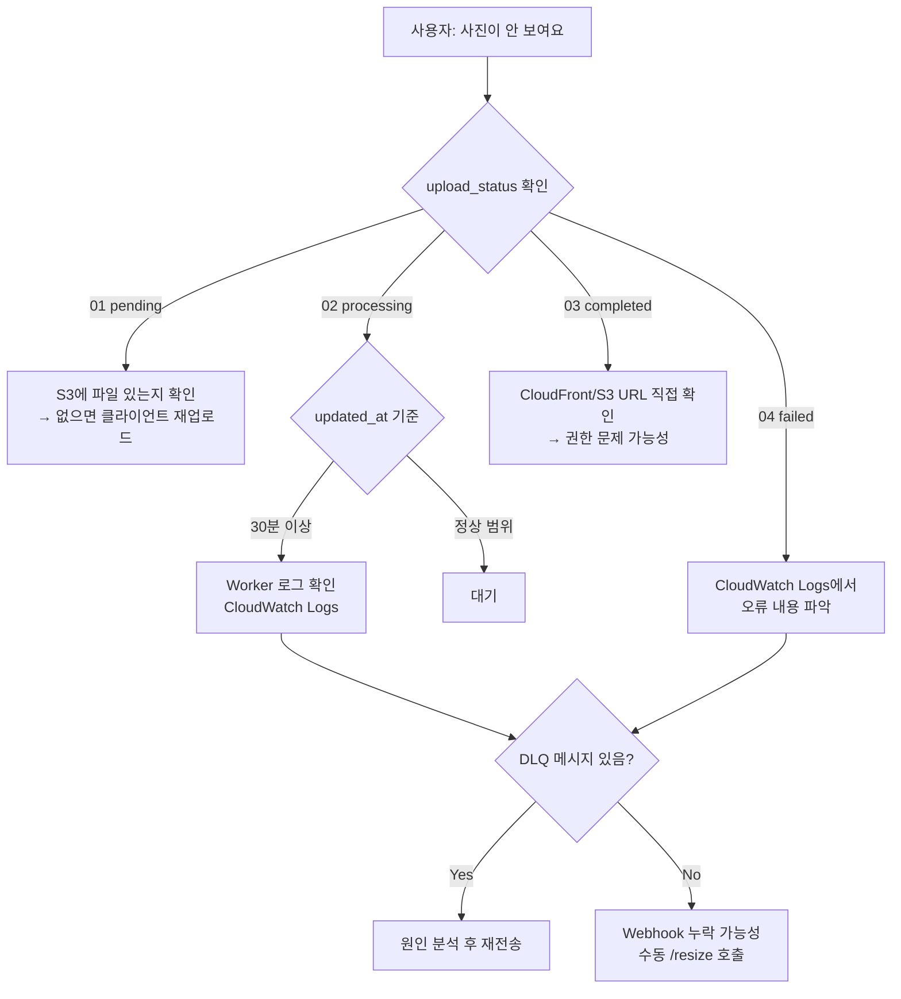

# 📘 Observability & Monitoring Design

## 1. Logging Strategy

### 로그 수집 구조

```
Lambda (API Server)     → CloudWatch Logs: /aws/lambda/yuno-api-{env}
ECS AI Batch            → CloudWatch Logs: /ecs/yuno-ai-{env}
ECS Video Worker        → CloudWatch Logs: /ecs/yuno-video-{env}
```

모든 컴포넌트는 `awslogs` 드라이버를 통해 CloudWatch Logs로 자동 수집된다.

### 로그 보존 기간

| 로그 그룹 | 보존 기간 |
|-----------|-----------|
| `/ecs/yuno-ai-{env}` | 30일 |
| `/ecs/yuno-video-{env}` | 30일 |
| `/aws/lambda/yuno-api-{env}` | AWS Lambda 기본값 |

### 로그 레벨 정책

| 레벨 | 사용 기준 |
|------|-----------|
| INFO | 정상 처리 완료, 상태 전이 |
| WARN | 재시도 발생, 임계값 근접 |
| ERROR | 처리 실패, DLQ 이동 |

---

## 2. Metrics Definition

### SQS 핵심 메트릭

| 메트릭 | 네임스페이스 | 용도 |
|--------|-------------|------|
| `ApproximateNumberOfMessagesVisible` | `AWS/SQS` | 적체량 — Worker 스케일링 트리거 |
| `NumberOfMessagesSent` | `AWS/SQS` | 업로드 처리량 |
| `ApproximateAgeOfOldestMessage` | `AWS/SQS` | 처리 지연 감지 |

### ECS 핵심 메트릭

| 메트릭 | 네임스페이스 | 용도 |
|--------|-------------|------|
| `DesiredCount` | `AWS/ECS` | 현재 태스크 수 |
| `MemoryUtilization` | `AWS/ECS` | OOM 위험 감지 |
| `CPUUtilization` | `AWS/ECS` | 처리 부하 확인 |

### Lambda 핵심 메트릭

| 메트릭 | 용도 |
|--------|------|
| `Duration` | API 응답 시간 |
| `Errors` | 5xx 오류율 |
| `Throttles` | 동시 실행 한계 도달 |

### 업로드 파이프라인 커스텀 지표 (권장)

현재 구현되어 있지 않으나, 추후 추가를 권장하는 지표:

| 지표 | 계산 방법 |
|------|-----------|
| 이미지 처리 성공률 | `upload_status = 03` / 전체 |
| 평균 처리 소요 시간 | `status=03` 전환 시각 - `created_at` |
| 일별 실패 건수 | `upload_status = 04` count/일 |

```sql
-- 오늘 처리 현황 확인 쿼리
SELECT
  upload_status,
  COUNT(*) as count
FROM media_items
WHERE created_at >= CURRENT_DATE
GROUP BY upload_status;
```

---

## 3. Alert Policy

### 현재 구성된 CloudWatch 알람

| 알람 이름 | 조건 | 액션 |
|-----------|------|------|
| `yuno-ai-task-scale-out` | SQS face-recognition 메시지 ≥ 1 (1분) | AI Task 스케일아웃 |
| `yuno-ai-task-scale-in` | SQS face-recognition 메시지 < 1 (3분 연속) | AI Task 스케일인 |
| `yuno-video-task-scale-out` | SQS video-processing 메시지 ≥ 1 (1분) | Video Task 스케일아웃 |
| `yuno-video-task-scale-in` | SQS video-processing 메시지 < 1 (3분 연속) | Video Task 스케일인 |

### 추가 권장 알람

| 알람 | 조건 | 알림 대상 |
|------|------|-----------|
| DLQ 메시지 누적 | face/video DLQ 메시지 수 > 0 | 운영자 이메일 / Slack |
| API 오류율 급증 | Lambda Errors > 50건/5분 | 운영자 |
| SQS 메시지 고령화 | `ApproximateAgeOfOldestMessage` > 30분 | 운영자 |

---

## 4. 장애 탐지 플로우



---

## 5. Tracing 전략

### 현재 상태

분산 트레이싱(AWS X-Ray, OpenTelemetry)은 미도입. 각 처리 단계는 `media_item_id`를 공통 식별자로 로그에 포함하여 수동 추적이 가능하다.

### 로그 기반 추적 방법

```bash
# 특정 media_item_id의 처리 로그 조회 (CloudWatch Logs Insights)
fields @timestamp, @message
| filter @message like /media_item_id/
| filter @message like "<target-uuid>"
| sort @timestamp asc
```

### 추후 도입 권장 (Phase 2+)

X-Ray 또는 OpenTelemetry를 도입하면 다음이 가능해진다:

- Lambda → SQS → ECS 간 End-to-End 추적
- 단계별 처리 시간 분포 시각화
- 병목 구간 자동 식별

도입 비용: X-Ray 기준 월 100만 트레이스 무료, 이후 $5/1백만 트레이스.

---

## 6. Container Insights

현재 Phase 1에서는 **비활성** 상태 (비용 절감).

```terraform
setting {
  name  = "containerInsights"
  value = "disabled"  # Phase 1 비용 절감
}
```

활성화 시 ECS Task별 CPU/메모리/네트워크 메트릭이 CloudWatch에 수집된다. 트래픽이 증가하여 Worker 성능 분석이 필요한 시점에 활성화를 권장한다. 추가 비용: ~$2/월 (현재 트래픽 기준).
