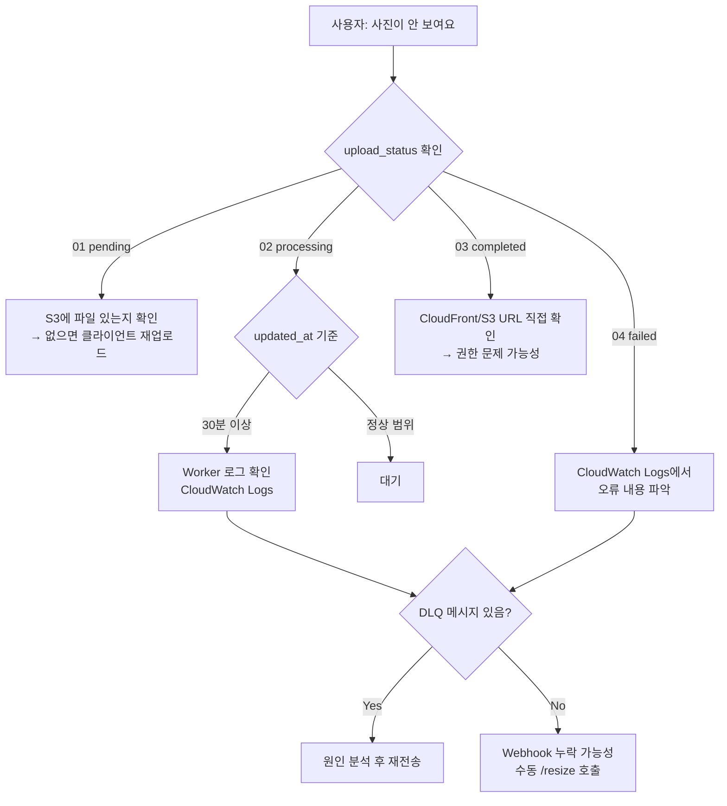

# 📘 Observability & Monitoring Design

## 1. Logging Strategy

### 로그 수집 구조

```
Lambda (API Server)     → CloudWatch Logs: /aws/lambda/yuno-api-{env}
ECS AI Batch            → CloudWatch Logs: /ecs/yuno-ai-{env}
ECS Video Worker        → CloudWatch Logs: /ecs/yuno-video-{env}
```

모든 컴포넌트는 `awslogs` 드라이버를 통해 CloudWatch Logs로 자동 수집된다.

### 로그 보존 기간

| 로그 그룹 | 보존 기간 |
|-----------|-----------|
| `/ecs/yuno-ai-{env}` | 30일 |
| `/ecs/yuno-video-{env}` | 30일 |
| `/aws/lambda/yuno-api-{env}` | AWS Lambda 기본값 |

### 로그 레벨 정책

| 레벨 | 사용 기준 |
|------|-----------|
| DEBUG | DB 쿼리, 외부 API 요청·응답 상세 (개발 환경만) |
| INFO | 정상 처리 완료, 상태 전이 |
| WARN | 재시도 발생, 부분 실패, 임계값 근접 |
| ERROR | 처리 실패, DLQ 이동, 복구 불가 오류 |

---

## 1-1. 구조화 로깅 (slog)

> 기존 `log.Printf` / `log.Println`을 Go 1.21 표준 `log/slog`로 전면 교체한다.  
> CloudWatch Logs Insights에서 JSON 필드로 직접 필터·집계할 수 있게 된다.

### 왜 slog인가?

| 기존 `log` | `log/slog` |
|-----------|-----------|
| 포맷이 문자열 (파싱 어려움) | JSON / Text 구조화 출력 |
| 레벨 없음 | DEBUG / INFO / WARN / ERROR |
| context 연동 없음 | `ctx`로 공통 필드 전파 가능 |
| 외부 라이브러리 필요 | Go 표준 라이브러리 |

---

### 1-2. Logger 초기화

`internal/logger` 패키지를 두고 앱 시작 시 한 번 초기화한다.  
이 시점에 **앱 전역 정적 필드** (`env`, `service`)를 기본 logger에 바인딩한다.  
이후 모든 `slog.Default()` 호출은 이 필드를 자동으로 포함한다.

```go
// internal/logger/logger.go
package logger

import (
    "log/slog"
    "os"
)

// Init은 앱 시작 시 딱 한 번 호출한다.
// env, service 같은 앱 전역 정적 필드를 기본 logger에 바인딩한다.
func Init(env, service string) {
    var handler slog.Handler
    if env == "local" || env == "dev" {
        handler = slog.NewTextHandler(os.Stdout, &slog.HandlerOptions{
            Level: slog.LevelDebug,
        })
    } else {
        handler = slog.NewJSONHandler(os.Stdout, &slog.HandlerOptions{
            Level: slog.LevelInfo,
        })
    }
    // env, service는 모든 로그에 자동 포함된다
    base := slog.New(handler).With(
        slog.String("env", env),
        slog.String("service", service),
    )
    slog.SetDefault(base)
}
```

각 진입점에서 호출 시 `service` 이름을 지정한다.

```go
// internal/api/app.go  → "yuno-api"
logger.Init(viper.GetString("APP_ENV"), "yuno-api")

// cmd/lambda-resize/main.go  → "yuno-resize-worker"
logger.Init(viper.GetString("APP_ENV"), "yuno-resize-worker")

// cmd/face-recognition-worker/main.go  → "yuno-face-worker"
logger.Init(viper.GetString("APP_ENV"), "yuno-face-worker")
```

**출력 예시 (프로덕션 JSON):**
```json
{"time":"2026-05-19T10:00:00Z","level":"INFO","msg":"resize job completed",
 "env":"prod","service":"yuno-resize-worker","layer":"worker",
 "media_item_id":"abc-123","duration_ms":340}
```

---

### 1-3. Context를 통한 공통 필드 전파

요청마다 `request_id`, 인증 후에는 `user_id` · `family_id`를 context에 심어  
하위 Service / Store 레이어가 별도 파라미터 없이 꺼내 쓴다.

```go
// internal/utils/log_context.go
package utils

import (
    "context"
    "log/slog"
)

type contextKey string

const (
    keyRequestID contextKey = "request_id"
    keyUserID    contextKey = "user_id"
    keyFamilyID  contextKey = "family_id"
)

func WithRequestID(ctx context.Context, id string) context.Context {
    return context.WithValue(ctx, keyRequestID, id)
}
func WithUserID(ctx context.Context, id string) context.Context {
    return context.WithValue(ctx, keyUserID, id)
}
func WithFamilyID(ctx context.Context, id string) context.Context {
    return context.WithValue(ctx, keyFamilyID, id)
}

// LogAttrs returns slog.Attr slice populated from context values.
func LogAttrs(ctx context.Context) []slog.Attr {
    var attrs []slog.Attr
    if v, ok := ctx.Value(keyRequestID).(string); ok && v != "" {
        attrs = append(attrs, slog.String("request_id", v))
    }
    if v, ok := ctx.Value(keyUserID).(string); ok && v != "" {
        attrs = append(attrs, slog.String("user_id", v))
    }
    if v, ok := ctx.Value(keyFamilyID).(string); ok && v != "" {
        attrs = append(attrs, slog.String("family_id", v))
    }
    return attrs
}
```

---

### 1-4. 표준 필드 목록

모든 로그에는 아래 필드를 일관되게 사용한다.

| 필드 | 타입 | 설명 |
|------|------|------|
| `request_id` | string | Echo request ID (미들웨어 삽입) |
| `user_id` | string | 인증된 사용자 UUID |
| `family_id` | string | 현재 요청의 가족 UUID |
| `media_item_id` | string | 미디어 처리 파이프라인 추적 키 |
| `layer` | string | `handler` / `service` / `worker` / `db` |
| `op` | string | 수행 중인 작업명 (예: `"upload_presign"`) |
| `duration_ms` | int64 | 처리 소요 시간 (ms) |
| `error` | string | 오류 메시지 (ERROR 레벨에서만) |

---

### 1-5. 레이어별 로깅 패턴

`layer` 필드는 **생성자에서 한 번만 바인딩**한다.  
`logger.Init()` 이후에 `slog.Default()`를 호출해야 `env` · `service`가 이미 포함된 logger를 받는다.

```
필드 바인딩 타이밍 요약

  logger.Init() 호출 시  →  env, service
  생성자(New*) 호출 시   →  layer, component
  각 로그 호출 시        →  op, media_item_id, duration_ms, error  (동적 값)
  context 전파           →  request_id, user_id, family_id
```

#### Handler

```go
type MediaItemHandler struct {
    log             *slog.Logger  // layer="handler" 고정
    mediaItemService services.MediaItemService
}

func NewMediaItemHandler(svc services.MediaItemService) *MediaItemHandler {
    return &MediaItemHandler{
        log: slog.Default().With("layer", "handler"),
        mediaItemService: svc,
    }
}

func (h *MediaItemHandler) BatchPresignUpload(c echo.Context) error {
    ctx := c.Request().Context()

    result, err := h.mediaItemService.BatchPresignUpload(ctx, req)
    if err != nil {
        h.log.ErrorContext(ctx, "batch presign upload failed", "error", err)
        return err
    }

    h.log.InfoContext(ctx, "batch presign upload ok",
        "op", "batch_presign_upload",
        "count", len(result),
    )
    return c.JSON(http.StatusOK, result)
}
```

#### Service

```go
type ResizeService struct {
    log *slog.Logger  // layer="service", component="resize" 고정
    // ...
}

func NewResizeService(...) *ResizeService {
    return &ResizeService{
        log: slog.Default().With("layer", "service", "component", "resize"),
        // ...
    }
}

func (s *ResizeService) ProcessResize(ctx context.Context, originalKey string) error {
    ok, err := s.mediaItemStore.UpdateMediaItemToProcessingIfPending(ctx, mediaItemID)
    if err != nil {
        s.log.ErrorContext(ctx, "status transition failed",
            "op", "status_to_processing",
            "media_item_id", mediaItemID,
            "error", err,
        )
        return err
    }
    if !ok {
        s.log.WarnContext(ctx, "duplicate event skipped", "media_item_id", mediaItemID)
        return nil
    }

    s.log.InfoContext(ctx, "resize processing started",
        "op", "process_resize",
        "media_item_id", mediaItemID,
    )
    // ...
}
```

#### Worker (SQS Consumer)

```go
type ResizeHandler struct {
    log           *slog.Logger  // layer="worker", component="resize" 고정
    resizeService *ResizeService
}

func NewResizeHandler(svc *ResizeService) *ResizeHandler {
    return &ResizeHandler{
        log: slog.Default().With("layer", "worker", "component", "resize"),
        resizeService: svc,
    }
}

func (h *ResizeHandler) Handle(ctx context.Context, msg *sqs.Message) error {
    h.log.InfoContext(ctx, "resize job received",
        "media_item_id", params.MediaItemID,
        "family_id", params.FamilyID,
    )

    start := time.Now()
    if err := h.resizeService.ProcessResize(ctx, params.OriginalKey); err != nil {
        h.log.ErrorContext(ctx, "resize job failed",
            "media_item_id", params.MediaItemID,
            "duration_ms", time.Since(start).Milliseconds(),
            "error", err,
        )
        return err
    }

    h.log.InfoContext(ctx, "resize job completed",
        "media_item_id", params.MediaItemID,
        "duration_ms", time.Since(start).Milliseconds(),
    )
    return nil
}
```

#### DB (query_logger)

`log.Printf` → `slog.DebugContext`로 교체. 프로덕션에서는 출력되지 않는다.

```go
type queryLogger struct {
    log     *slog.Logger  // layer="db" 고정
    inner   DBTX
    enabled bool
}

func NewQueryLogger(inner DBTX, enabled bool) DBTX {
    if !enabled {
        return inner
    }
    return &queryLogger{
        log:     slog.Default().With("layer", "db"),
        inner:   inner,
        enabled: true,
    }
}

func (q *queryLogger) logQuery(ctx context.Context, query string, args ...interface{}) {
    q.log.DebugContext(ctx, "db query",
        "query", strings.TrimSpace(query),
        "args", args,
    )
}
```

---

### 1-6. HTTP 요청 로깅 미들웨어

Echo의 기본 logger 미들웨어 대신 slog 기반 커스텀 미들웨어를 사용한다.

```go
// internal/api/middlewares/request_logger.go
func RequestLogger() echo.MiddlewareFunc {
    return func(next echo.HandlerFunc) echo.HandlerFunc {
        return func(c echo.Context) error {
            start := time.Now()
            req := c.Request()
            ctx := req.Context()

            // request_id를 context에 심기
            requestID := c.Response().Header().Get(echo.HeaderXRequestID)
            ctx = utils.WithRequestID(ctx, requestID)
            c.SetRequest(req.WithContext(ctx))

            err := next(c)

            slog.LogAttrs(ctx, slog.LevelInfo, "http request",
                slog.String("method", req.Method),
                slog.String("path", req.URL.Path),
                slog.Int("status", c.Response().Status),
                slog.Int64("duration_ms", time.Since(start).Milliseconds()),
                slog.String("request_id", requestID),
                slog.String("ip", c.RealIP()),
            )
            return err
        }
    }
}
```

---

### 1-7. 기존 코드 마이그레이션 체크리스트

| 파일 | 현재 | 변경 후 |
|------|------|---------|
| `internal/api/app.go` | `log.Fatalf(...)` | `slog.Error(...); os.Exit(1)` |
| `internal/api/middlewares/error.go` | `log.Printf("request_id=%s ...")` | `slog.ErrorContext(ctx, ..., slog.String("request_id", ...))` |
| `internal/api/middlewares/guard.go` | `log.Println("access token cookie ...")` | `slog.WarnContext(ctx, "missing access token")` |
| `internal/services/media_item_service.go` | `log.Printf("media_item 롤백 실패 ...")` | `slog.ErrorContext(ctx, "rollback failed", slog.String("media_item_id", ...))` |
| `internal/db/query_logger.go` | `log.Printf("[DB] ...")` | `slog.DebugContext(ctx, "db query", ...)` |
| `internal/services/face_recognition_dispatcher.go` | `log.Fatalf(...)` | `slog.Error(...); os.Exit(1)` |
| `internal/worker/**` | `log.Printf(...)` | `slog.InfoContext / ErrorContext` |

---

### 1-8. CloudWatch Logs Insights 쿼리 예시

slog JSON 출력 후 아래 쿼리로 필드 직접 필터·집계가 가능하다.

```
# 특정 media_item_id 전체 처리 흐름 추적
fields @timestamp, layer, op, duration_ms
| filter media_item_id = "<target-uuid>"
| sort @timestamp asc

# 최근 1시간 ERROR 로그 목록
fields @timestamp, layer, op, error, request_id
| filter level = "ERROR"
| sort @timestamp desc
| limit 50

# Worker 처리 시간 분포
fields duration_ms
| filter layer = "worker" and op = "process_resize"
| stats avg(duration_ms), max(duration_ms), count() by bin(5m)
```

---

## 2. Metrics Definition

### SQS 핵심 메트릭

| 메트릭 | 네임스페이스 | 용도 |
|--------|-------------|------|
| `ApproximateNumberOfMessagesVisible` | `AWS/SQS` | 적체량 — Worker 스케일링 트리거 |
| `NumberOfMessagesSent` | `AWS/SQS` | 업로드 처리량 |
| `ApproximateAgeOfOldestMessage` | `AWS/SQS` | 처리 지연 감지 |

### ECS 핵심 메트릭

| 메트릭 | 네임스페이스 | 용도 |
|--------|-------------|------|
| `DesiredCount` | `AWS/ECS` | 현재 태스크 수 |
| `MemoryUtilization` | `AWS/ECS` | OOM 위험 감지 |
| `CPUUtilization` | `AWS/ECS` | 처리 부하 확인 |

### Lambda 핵심 메트릭

| 메트릭 | 용도 |
|--------|------|
| `Duration` | API 응답 시간 |
| `Errors` | 5xx 오류율 |
| `Throttles` | 동시 실행 한계 도달 |

### 업로드 파이프라인 커스텀 지표 (권장)

현재 구현되어 있지 않으나, 추후 추가를 권장하는 지표:

| 지표 | 계산 방법 |
|------|-----------|
| 이미지 처리 성공률 | `upload_status = 03` / 전체 |
| 평균 처리 소요 시간 | `status=03` 전환 시각 - `created_at` |
| 일별 실패 건수 | `upload_status = 04` count/일 |

```sql
-- 오늘 처리 현황 확인 쿼리
SELECT
  upload_status,
  COUNT(*) as count
FROM media_items
WHERE created_at >= CURRENT_DATE
GROUP BY upload_status;
```

---

## 3. Alert Policy

### 현재 구성된 CloudWatch 알람

| 알람 이름 | 조건 | 액션 |
|-----------|------|------|
| `yuno-ai-task-scale-out` | SQS face-recognition 메시지 ≥ 1 (1분) | AI Task 스케일아웃 |
| `yuno-ai-task-scale-in` | SQS face-recognition 메시지 < 1 (3분 연속) | AI Task 스케일인 |
| `yuno-video-task-scale-out` | SQS video-processing 메시지 ≥ 1 (1분) | Video Task 스케일아웃 |
| `yuno-video-task-scale-in` | SQS video-processing 메시지 < 1 (3분 연속) | Video Task 스케일인 |

### 추가 권장 알람

| 알람 | 조건 | 알림 대상 |
|------|------|-----------|
| DLQ 메시지 누적 | face/video DLQ 메시지 수 > 0 | 운영자 이메일 / Slack |
| API 오류율 급증 | Lambda Errors > 50건/5분 | 운영자 |
| SQS 메시지 고령화 | `ApproximateAgeOfOldestMessage` > 30분 | 운영자 |

---

## 4. 장애 탐지 플로우



---

## 5. Tracing 전략

### 현재 상태

분산 트레이싱(AWS X-Ray, OpenTelemetry)은 미도입. 각 처리 단계는 `media_item_id`를 공통 식별자로 로그에 포함하여 수동 추적이 가능하다.

### 로그 기반 추적 방법

```bash
# 특정 media_item_id의 처리 로그 조회 (CloudWatch Logs Insights)
fields @timestamp, @message
| filter @message like /media_item_id/
| filter @message like "<target-uuid>"
| sort @timestamp asc
```

### 추후 도입 권장 (Phase 2+)

X-Ray 또는 OpenTelemetry를 도입하면 다음이 가능해진다:

- Lambda → SQS → ECS 간 End-to-End 추적
- 단계별 처리 시간 분포 시각화
- 병목 구간 자동 식별

도입 비용: X-Ray 기준 월 100만 트레이스 무료, 이후 $5/1백만 트레이스.

---

## 6. Container Insights

현재 Phase 1에서는 **비활성** 상태 (비용 절감).

```terraform
setting {
  name  = "containerInsights"
  value = "disabled"  # Phase 1 비용 절감
}
```

활성화 시 ECS Task별 CPU/메모리/네트워크 메트릭이 CloudWatch에 수집된다. 트래픽이 증가하여 Worker 성능 분석이 필요한 시점에 활성화를 권장한다. 추가 비용: ~$2/월 (현재 트래픽 기준).
